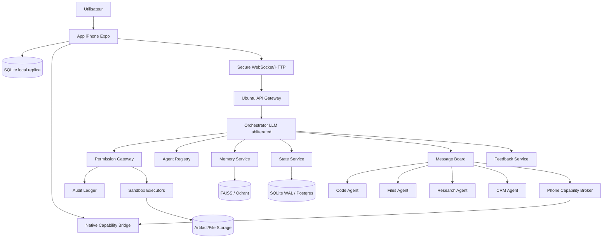

# 03 — System Architecture

## Vue d'ensemble

Le système est séparé en cinq plans:

1. **Interface plane**: iPhone Expo app.
2. **Control plane**: Ubuntu API + orchestrateur + registry.
3. **Execution plane**: workers/executors sandboxés.
4. **Data plane**: state DB, memory vector DB, artifacts disk.
5. **Governance plane**: permissions, audit, feedback, evals.

## Diagramme logique



## Composants

### iPhone Expo App

Responsabilités:

- UI chat/tasks/approvals/memory/settings;
- capture voix/texte;
- notifications;
- cache local;
- sync outbox;
- affichage des demandes de permissions;
- accès aux APIs natives autorisées;
- transmission des résultats iPhone vers Ubuntu.

### Ubuntu API Gateway

Responsabilités:

- pairing/auth;
- endpoints REST;
- WebSocket live;
- validation schema;
- rate limit;
- dispatch vers orchestrateur/services.

### Orchestrator LLM

Responsabilités:

- comprendre l'intention;
- récupérer contexte;
- planifier;
- router vers agents;
- produire des tool calls JSON;
- demander permission au lieu de refuser;
- résumer les résultats.

### Permission Gateway

Responsabilités:

- scorer le risque;
- appliquer allow/deny/ask;
- générer demandes d'approbation;
- bloquer actions non conformes;
- normaliser les refus modèle en demandes structurées;
- écrire audit log.

### State Service

Responsabilités:

- tâches;
- conversations;
- agents;
- permissions;
- sync ops;
- artifacts metadata;
- feedback metadata.

### Memory Service

Responsabilités:

- chunking;
- embeddings;
- semantic search;
- memory write/update;
- retrieval context pack;
- privacy scopes.

### Message Board

Responsabilités:

- communication agent-agent;
- work queue;
- heartbeat;
- task status;
- fanout events.

### Workers

Responsabilités:

- exécuter une spécialité;
- respecter schémas;
- passer les actions sensibles à la gateway;
- publier status et output.

## Pattern principal

```text
User intent
  → mobile command
  → Ubuntu task
  → orchestrator plan
  → memory/state retrieval
  → agent delegation
  → permission gateway
  → executor/tool
  → result
  → feedback/audit/memory update
  → mobile UI
```

## Choix forts

- Les agents sont remplaçables.
- La DB n'est jamais manipulée directement par les agents.
- Les prompts ne remplacent pas la sécurité.
- Les outils sont petits, typés et testés.
- Les réponses LLM sont considérées non fiables jusqu'à validation.
