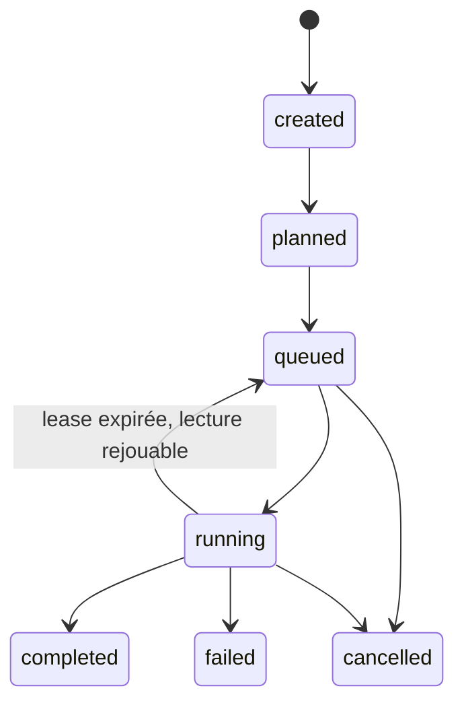
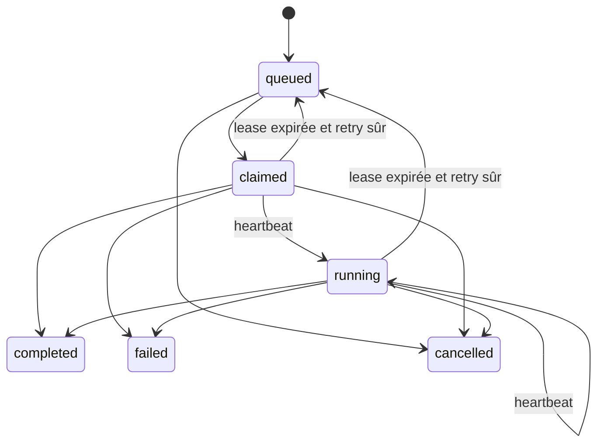

# 07 — Agent Swarm Protocol

> **IMPLEMENTED — slice `0.9.0`:** registre authentifié, capacité déclarée,
> ordonnanceur déterministe, une seule job active par tâche, leases opaques
> expirables avec génération de fencing, heartbeat, résultats terminaux
> idempotents, reaper borné et outbox transactionnelle vers un board SQLite.
> **PLANNED:** Redis Streams/NATS, consumer groups, bus réseau et ordonnanceur
> autonome multi-hôte.

Le worker exemple `workers/file-worker` ne sait que lister ou lire sous une
racine dédiée et refuse les chemins protégés. La mise en file n'accepte que des
outils de lecture explicitement autorisés par la Gateway.

## Objectif

Permettre à un orchestrateur de gérer des agents autonomes à distance via registry, message board et task lifecycle.

## Concepts

### Agent

Un service spécialisé qui peut accepter des tâches.

### Agent Card — PLANNED

Fichier JSON publié par chaque agent:

```http
GET /.well-known/agent-card.json
```

Le fichier cible contiendrait:

- id;
- name;
- version;
- endpoint;
- skills;
- input/output modes;
- auth;
- model profile;
- permissions max;
- heartbeat interval.

### Skill

Dans `0.9.0`, une compétence est un identifiant déclaré dans `skills` et validé
par le control plane. Le document riche suivant reste un format cible:

```json
{
  "id": "code.inspect",
  "description": "Inspecte un repo sans modifier",
  "input_schema": "schema://tool-call",
  "risk": "low"
}
```

### Task

Un travail assigné à un agent.

### Event

Toute progression publiée sur le message board.

## Contrat HTTP worker implémenté

L'enregistrement est initié par un iPhone déjà jumelé:

```http
POST /agents/register
Authorization: Bearer <device-token>
```

La réponse contient une seule fois la credential opaque de l'agent. La requête
déclare notamment `skills`, `max_concurrency` (1 à 32) et une map `capacity`.
Seul un agent `online`, sous sa limite de concurrence et possédant la compétence
demandée peut réclamer une job.

Le worker s'authentifie ensuite avec sa propre credential:

```http
POST /agents/{agent_id}/heartbeat
POST /agents/{agent_id}/claim
POST /agents/{agent_id}/jobs/{job_id}/heartbeat
POST /agents/{agent_id}/jobs/{job_id}/result
Authorization: Bearer <agent-credential>
```

`claim` sélectionne par priorité de tâche, puis ancienneté et identifiant. La
réponse contient `claim_token`, `lease_id`, `lease_expires_at` et
`lease_generation`; le token n'est stocké qu'en digest côté serveur. Le champ
`wait_seconds` est accepté entre 0 et 30, mais le slice actuel ne fait pas de
long-poll: il retourne immédiatement une job ou `null`.

Le heartbeat et le résultat doivent renvoyer ensemble `claim_token`, `lease_id`
et `lease_generation`. Une preuve incomplète, étrangère, périmée ou fencée
reçoit `409` (ou `422` si sa forme est invalide); elle ne peut ni prolonger la
nouvelle lease ni écraser son résultat.

## Lifecycles implémentés

Tâche distribuée:



Job distante:



L'index SQLite `idx_agent_jobs_one_active_task` interdit plusieurs jobs dans
`queued`, `claimed` ou `running` pour une même tâche. Une réclamation incrémente
`attempt_count` et `lease_generation`. Le heartbeat renouvelle
`lease_expires_at`; un résultat terminal fait évoluer la job et sa tâche dans la
même transaction que l'audit et l'entrée d'outbox.

Au démarrage puis périodiquement, le reaper clôt les leases expirées. Seules
`workspace.list_dir` et `workspace.read_text` sont automatiquement remises en
file, tant que `attempt_count < max_attempts` (3 par défaut) et que la génération
expirée n'a créé aucune demande de capability iPhone. Toute activité iPhone,
toute autre action ou un budget épuisé devient `failed` avec issue potentiellement
incertaine et produit un événement de dead letter dans SQLite. L'annulation
d'une tâche fence aussi sa job et annule toute demande iPhone liée à la
génération courante.

Chaque heartbeat renouvelle `heartbeat_at` et `lease_expires_at` dans la ligne
autoritative. Pour éviter une croissance durable proportionnelle à la fréquence,
l'outbox/board ne conserve qu'un événement heartbeat par job et génération de
lease, au moyen d'une clé de déduplication stable.

## Message envelope réseau — PLANNED

Le board SQLite livré utilise le schéma persistant décrit dans
`docs/14-message-board-events.md`. L'enveloppe inter-hôtes suivante reste une
cible et n'est ni signée ni transportée par le runtime actuel:

```json
{
  "id": "evt_01",
  "type": "task.assigned",
  "task_id": "tsk_01",
  "agent_id": "code-worker-01",
  "timestamp": "2026-09-04T11:30:00Z",
  "trace_id": "trc_01",
  "payload": {},
  "signature": "optional"
}
```

## Topics du board SQLite — IMPLEMENTED

| Topic | Producteur | Usage actuel |
|---|---|---|
| `tasks.inbox` | orchestrator | workers |
| `tasks.status` | workers | app/orchestrator |
| `agents.heartbeat` | agents | registry |
| `iphone.capabilities` | capability gateway | iPhone ciblé |
| `agent.job.capability.result` | iPhone/reaper | worker/orchestrator |

Les transitions persistantes ajoutent d'abord une ligne à `outbox_events` dans
la transaction métier. Le drain publie ensuite au moins une fois dans
`message_board_events`. Une `dedupe_key` unique rend sûr le rejeu après une
panne entre publication et marquage. Ce board n'est pas exposé comme Redis et
ne fournit pas de consumer group réseau.

## Bus externe — PLANNED

Redis Streams ou NATS JetStream pourront remplacer l'implémentation derrière
l'interface du board. Leur protocole, les consumer groups, le partitionnement
et une dead-letter queue externe ne sont pas implémentés dans `0.9.0`.

## Remote worker boot

1. Un appareil jumelé enregistre le worker et conserve sa credential hors Git.
2. Le worker démarre, charge sa configuration et envoie un heartbeat `online`.
3. Un appareil jumelé place une action de lecture autorisée dans la file.
4. Le worker réclame la job, conserve la preuve de lease en mémoire et démarre
   son heartbeat de job.
5. Il exécute uniquement la compétence annoncée et soumet un résultat réel.
6. Il n'annonce jamais de succès si la lease est perdue ou si l'état du résultat
   est incertain.

## Agent-to-agent communication

Les agents ne se parlent pas en direct. Ils passent par les endpoints HTTP
authentifiés; les services du control plane inscrivent ensuite les événements
durables dans l'outbox/board SQLite. L'orchestrateur et le registre arbitrent.

Plus tard, A2A direct possible avec:

- agent cards;
- JSON-RPC;
- JWT;
- task envelope;
- per-skill permission scopes.

## Worker classes

Seul le Files Worker de lecture ci-dessous est livré comme worker exécutable;
les autres classes sont **PLANNED**.

### Code Worker

- inspect repo;
- propose patch;
- run tests;
- write patch uniquement via permission.

### Files Worker

- `workspace.list_dir` et `workspace.read_text` sous une racine dédiée;
- aucun write et aucun processus;
- heartbeat de lease, suppression du résultat si la lease est perdue;
- demande iPhone optionnelle uniquement via le broker du control plane.

### Research Worker

- web/doc search;
- source summary;
- citation pack.

### CRM Worker

- contacts/prospects/tasks;
- follow-up planning;
- email draft.

### Design Worker

- critique UI;
- prompts image;
- audit brand.

### Phone Broker Worker

- reçoit demandes d'agents;
- route vers iPhone;
- attend approbation/résultat.

## Fail-safe behavior

- Agent non `online` ou capacité pleine = aucune nouvelle claim.
- Lease expirée/étrangère = `409`, résultat supprimé par le worker.
- Lecture rejouable expirée = retry borné; autre action = échec sans rejeu.
- Demande iPhone sans lease active, sans grant ou avec digest différent = `409`.
- Résultat supérieur à 1 Mo = refusé.
- Redis/NATS indisponible n'entre pas en jeu: le runtime `0.9.0` est SQLite.
