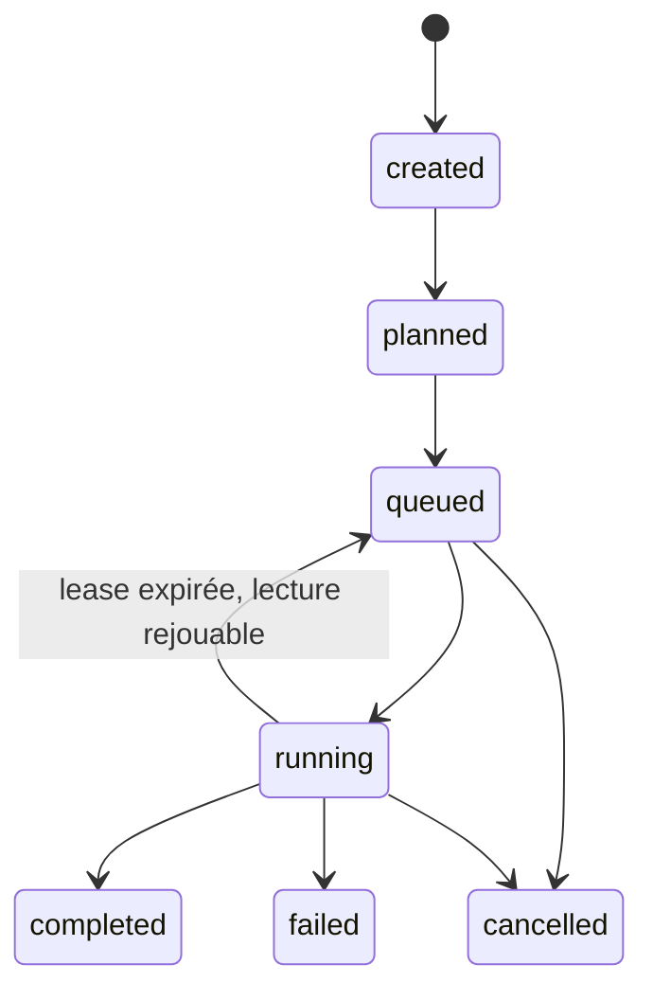
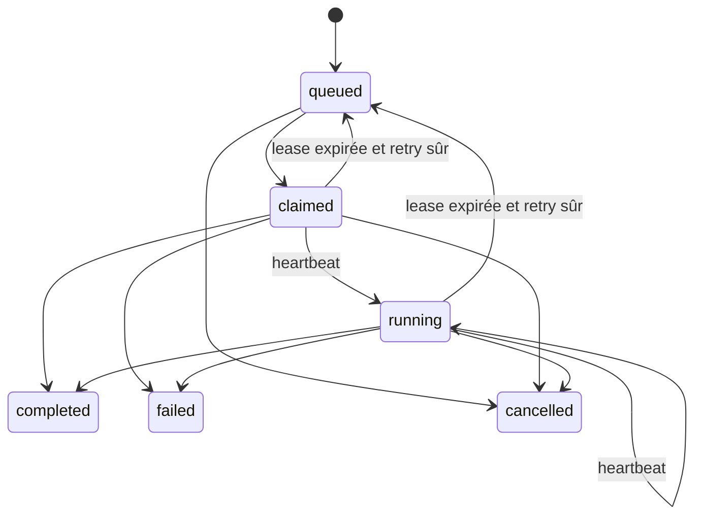

# 07 — Agent Swarm Protocol

> **IMPLEMENTED — slice `0.10.0`:** registre authentifié, Agent Cards validées
> par le serveur, capacité déclarée,
> ordonnanceur déterministe, une seule job active par tâche, leases opaques
> expirables avec génération de fencing, heartbeat, résultats terminaux
> idempotents, reaper borné, claims de publication d'outbox fenced, board SQLite
> par défaut et adaptateur Redis Streams optionnel. Trois workers étroits sont
> fournis: Files, Research et Code Review. **PLANNED:** qualification
> multi-hôte de production, workers consommant des affectations push, NATS et
> autres classes métier.

Les workers n'obtiennent ni accès Redis, ni bearer iPhone, ni privilège de
shell générique. La mise en file n'accepte que les skills et payloads bornés par
la politique serveur et par la Gateway.

## Objectif

Permettre à un orchestrateur de gérer des agents autonomes à distance via registry, message board et task lifecycle.

## Concepts

### Agent

Un service spécialisé qui peut accepter des tâches.

### Agent Card — IMPLEMENTED

Chaque worker livre un manifeste statique `agent-card.json` de métadonnées
seulement. Le control plane ne fait pas confiance à ce fichier comme preuve
d'autorisation: `POST /agents/register` revalide la version de protocole,
l'unique famille de skills, les limites, le runtime, l'endpoint et le modèle,
puis applique la politique opérateur courante et persiste uniquement la carte
approuvée. Cette politique est réévaluée lors de chaque claim et avant un retry
du reaper: une révocation ne peut donc pas être contournée par une carte ou un
job déjà persisté. Le registre projette:

- `agent_id`, `name`, `version`;
- `skills` appartenant à l'allowlist serveur;
- `model_id` optionnel et `runtime` actuellement limité à Python;
- `max_concurrency` et capabilities numériques bornées;
- `supported_protocol_version`.

Les manifests Research/Code Review décrivent aussi une politique déclarative
fermée (`writes: false`, aucun shell et réseau limité selon la famille), que le
validateur compare à la famille de skills. Une carte ne contient ni credential,
ni bearer, ni URL avec identifiants, ni secret. Il n'existe pas encore de
discovery HTTP `/.well-known` ou de négociation multi-version.

### Skill

Dans `0.10.0`, les identifiants exécutables sont limités à:

- `workspace.list_dir`, `workspace.read_text`;
- `research.query`;
- `code_review.git_status`, `code_review.git_diff`,
  `code_review.git_show`, `code_review.static_analysis`.

Une compétence inconnue, privilégiée ou issue d'une autre famille dans la même
carte est refusée. Les détails riches suivants restent un format cible interne,
pas une extension libre contrôlée par le worker:

```json
{
  "id": "code.inspect",
  "description": "Inspecte un repo sans modifier",
  "input_schema": "schema://tool-call",
  "risk": "low"
}
```

### Task

Un travail assigné à un agent.

### Event

Toute progression publiée sur le message board.

## Contrat HTTP worker implémenté

L'enregistrement est initié par un iPhone déjà jumelé:

```http
POST /agents/register
Authorization: Bearer <device-token>
```

La réponse contient une seule fois la credential opaque de l'agent. La requête
déclare notamment `skills`, `max_concurrency` (1 à 32), `runtime`, protocole et
une map `capacity` bornée. Seul un agent `online`, compatible, sous sa limite de
concurrence et possédant la compétence approuvée peut réclamer une job. Un agent
`draining` termine son travail courant mais ne réclame rien de nouveau.

Le worker s'authentifie ensuite avec sa propre credential:

```http
POST /agents/{agent_id}/heartbeat
POST /agents/{agent_id}/claim
POST /agents/{agent_id}/jobs/{job_id}/heartbeat
POST /agents/{agent_id}/jobs/{job_id}/result
Authorization: Bearer <agent-credential>
```

`claim` parcourt les jobs par priorité de tâche, ancienneté et identifiant, puis
applique le scheduler v2 à chaque job. L'éligibilité exige protocole et skill
approuvés, état `online`, heartbeat plus récent que
`MONGARS_AGENT_OFFLINE_TIMEOUT_SECONDS` et capacité disponible. Ce timeout doit
rester supérieur à l'intervalle de heartbeat; `/status` applique le même cutoff
pour ses compteurs actifs/hors ligne. Le classement utilise, dans l'ordre,
ratio `active_jobs/max_concurrency`, score observé décroissant, latence
si au moins trois résultats existent, plus ancien `last_seen_at`, puis ID stable.
Le worker appelant n'obtient la job que s'il est le candidat choisi. La décision
et ses candidats expurgés sont persistés dans `scheduler_decisions`; aucun LLM
ne choisit l'éligibilité. La réponse contient `claim_token`, `lease_id`,
`lease_expires_at` et
`lease_generation`; le token n'est stocké qu'en digest côté serveur. Le champ
`wait_seconds` est accepté entre 0 et 30, mais le slice actuel ne fait pas de
long-poll: il retourne immédiatement une job ou `null`.

Le heartbeat et le résultat doivent renvoyer ensemble `claim_token`, `lease_id`
et `lease_generation`. Une preuve incomplète, étrangère, périmée ou fencée
reçoit `409` (ou `422` si sa forme est invalide); elle ne peut ni prolonger la
nouvelle lease ni écraser son résultat.

## Lifecycles implémentés

Tâche distribuée:



Job distante:



L'index SQLite `idx_agent_jobs_one_active_task` interdit plusieurs jobs dans
`queued`, `claimed` ou `running` pour une même tâche. Une réclamation incrémente
`attempt_count` et `lease_generation`. Le heartbeat renouvelle
`lease_expires_at`; un résultat terminal fait évoluer la job et sa tâche dans la
même transaction que l'audit et l'entrée d'outbox.

Au démarrage puis périodiquement, le reaper clôt les leases expirées. Seules
`workspace.list_dir` et `workspace.read_text` sont automatiquement remises en
file, tant que `attempt_count < max_attempts` (3 par défaut) et que la génération
expirée n'a créé aucune demande de capability iPhone. Toute activité iPhone,
toute autre action ou un budget épuisé devient `failed` avec issue potentiellement
incertaine et produit un événement de dead letter dans SQLite. L'annulation
d'une tâche fence aussi sa job et annule toute demande iPhone liée à la
génération courante.

Chaque heartbeat renouvelle `heartbeat_at` et `lease_expires_at` dans la ligne
autoritative. Pour éviter une croissance durable proportionnelle à la fréquence,
l'outbox/board ne conserve qu'un événement heartbeat par job et génération de
lease, au moyen d'une clé de déduplication stable.

## Enveloppe durable — IMPLEMENTED

Tous les backends reçoivent une enveloppe applicative indépendante de leur ID:

```json
{
  "schema_version": "1.0",
  "event_id": "evt_01",
  "dedupe_key": "agent-job:job_01:queued",
  "topic": "tasks.inbox",
  "event_type": "published",
  "aggregate_type": "agent_job",
  "aggregate_id": "job_01",
  "task_id": "tsk_01",
  "agent_id": "code-worker-01",
  "payload": {},
  "created_at": "2026-09-08T11:30:00Z"
}
```

`dedupe_key` est obligatoire pour toute publication durable. Les identifiants
SQLite ou Redis ne remplacent jamais `event_id` et ne commandent aucun état
métier.

## Topics du board — IMPLEMENTED

| Topic | Producteur | Usage actuel |
|---|---|---|
| `tasks.inbox` | orchestrator | notification de file; les workers réclament par API |
| `tasks.status` | workers | projection interne/app/orchestrator |
| `agents.heartbeat` | agents | registry |
| `iphone.capabilities` | capability gateway | iPhone ciblé |
| `agent.job.capability.result` | iPhone/reaper | worker/orchestrator |

Les transitions persistantes ajoutent d'abord une ligne à `outbox_events` dans
la transaction métier. Les drainers concurrents revendiquent ensuite des lignes
avec `publishing_owner`, expiration et `publish_generation`. Seul le
propriétaire courant de la génération non expirée peut écrire `published_at`.
Après expiration, un autre processus reprend la ligne avec une génération
supérieure. La livraison est au moins une fois: un crash après publication mais
avant le marquage republie le même `event_id`/`dedupe_key` et converge par
déduplication.

## Backends et consumers

### IMPLEMENTED

- `SQLiteMessageBoard`, backend par défaut;
- `RedisStreamsMessageBoard`, dépendance optionnelle activée uniquement par
  `MONGARS_MESSAGE_BOARD_BACKEND=redis` et `MONGARS_REDIS_URL`;
- quatre familles de streams Redis: `<prefix>:tasks`, `:agents`, `:iphone` et
  `:system`;
- déduplication Redis atomique par `dedupe_key` applicative;
- santé `connected`/`degraded` et dernière publication réussie, sans exposer
  l'URL ni les credentials;
- `ConsumerCheckpointStore`/`MessageConsumer` SQLite pour services internes de
  confiance: identité contrôlée par l'application, claim fenced, ack après
  succès du handler, retry borné, dead letter et checkpoint.

En mode Redis, une panne ne change ni tâche ni job: l'événement reste non publié
dans l'outbox SQLite et sera repris. Les workers continuent d'utiliser les API
HTTP authentifiées; ils ne connaissent pas Redis. La fondation consumer n'est
pas encore raccordée à un consumer group Redis de production.

### PLANNED

- qualification TLS/auth, haute disponibilité, sauvegarde et reprise Redis
  multi-hôte;
- ingestion consumer-group Redis dans les services internes;
- NATS JetStream et dead-letter stream externe si nécessaires;
- workers affectés par push. La release ne revendique pas une disponibilité
  multi-hôte de production.

## Remote worker boot

1. Un appareil jumelé enregistre le worker et conserve sa credential hors Git.
2. Le worker démarre, charge sa configuration et envoie un heartbeat `online`.
3. Un appareil jumelé place une action de lecture autorisée dans la file.
4. Le worker réclame la job, conserve la preuve de lease en mémoire et démarre
   son heartbeat de job.
5. Il exécute uniquement la compétence annoncée et soumet un résultat réel.
6. Il n'annonce jamais de succès si la lease est perdue ou si l'état du résultat
   est incertain.

## Agent-to-agent communication

Les agents ne se parlent pas en direct. Ils passent par les endpoints HTTP
authentifiés; les services du control plane inscrivent ensuite les événements
durables dans l'outbox/board SQLite. L'orchestrateur et le registre arbitrent.

Un A2A direct futur demanderait encore:

- publication/discovery authentifiée des Agent Cards;
- JSON-RPC;
- JWT;
- task envelope;
- per-skill permission scopes.

## Worker classes

### Files Worker

- `workspace.list_dir` et `workspace.read_text` sous une racine dédiée;
- aucun write et aucun processus;
- heartbeat de lease, suppression du résultat si la lease est perdue;
- demande iPhone optionnelle uniquement via le broker du control plane.

### Research Worker — IMPLEMENTED

- accepte seulement `research.query` avec texte et limite de résultats bornés;
- utilise une seule URL HTTPS d'adaptateur configurée par l'opérateur, jamais
  fournie par le job;
- refuse redirects et options réseau arbitraires, borne temps et octets;
- marque titres, URL et extraits comme contenu externe non fiable;
- n'est jamais redistribué automatiquement après expiration.

### Code Review Worker — IMPLEMENTED

- expose uniquement status/diff/show Git et analyse Ruff isolée;
- construit des argv fixes sans shell, hook, pager, prompt, configuration Git
  globale, filtre externe, lazy fetch ni write;
- exige des chemins relatifs, réguliers, non symlink et non protégés;
- n'écrit pas, ne pousse pas et ne reçoit aucune commande arbitraire;
- n'est jamais redistribué automatiquement après expiration.

### Code Worker avec écriture — PLANNED

- proposition de patch, tests et écriture uniquement après nouveau contrat
  d'idempotence et décision Gateway;
- aucun worker actuel n'offre ce privilège.

### CRM Worker — PLANNED

- contacts/prospects/tasks;
- follow-up planning;
- email draft.

### Design Worker — PLANNED

- critique UI;
- prompts image;
- audit brand.

### Phone Broker Worker — PLANNED

- reçoit demandes d'agents;
- route vers iPhone;
- attend approbation/résultat.

## Fail-safe behavior

- Agent non `online` ou capacité pleine = aucune nouvelle claim.
- Carte/protocole/skill non allowlisté = enregistrement ou dispatch refusé.
- Skill révoqué après mise en file = job non claimable; après expiration d'une
  lease, dead letter sans redistribution.
- Lease expirée/étrangère = `409`, résultat supprimé par le worker.
- Lecture rejouable expirée = retry borné; autre action = échec sans rejeu.
- Demande iPhone sans lease active, sans grant ou avec digest différent = `409`.
- Résultat supérieur à 1 Mo = refusé.
- Redis indisponible = état SQLite conservé et outbox en attente; aucun succès
  de publication n'est inventé. NATS n'est pas implémenté.
