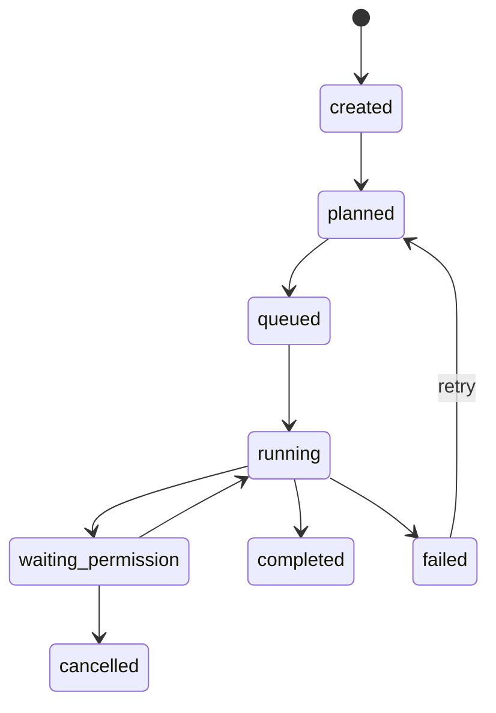

# 07 — Agent Swarm Protocol

## Objectif

Permettre à un orchestrateur de gérer des agents autonomes à distance via registry, message board et task lifecycle.

## Concepts

### Agent

Un service spécialisé qui peut accepter des tâches.

### Agent Card

Fichier JSON publié par chaque agent:

```http
GET /.well-known/agent-card.json
```

Contient:

- id;
- name;
- version;
- endpoint;
- skills;
- input/output modes;
- auth;
- model profile;
- permissions max;
- heartbeat interval.

### Skill

Une capacité déclarée:

```json
{
  "id": "code.inspect",
  "description": "Inspecte un repo sans modifier",
  "input_schema": "schema://tool-call",
  "risk": "low"
}
```

### Task

Un travail assigné à un agent.

### Event

Toute progression publiée sur le message board.

## Lifecycle



## Message envelope

```json
{
  "id": "evt_01",
  "type": "task.assigned",
  "task_id": "tsk_01",
  "agent_id": "code-worker-01",
  "timestamp": "2026-09-04T11:30:00Z",
  "trace_id": "trc_01",
  "payload": {},
  "signature": "optional"
}
```

## Streams Redis MVP

| Stream | Producer | Consumer |
|---|---|---|
| `tasks.inbox` | orchestrator | workers |
| `tasks.status` | workers | app/orchestrator |
| `permission.requests` | gateway | app |
| `permission.decisions` | app | gateway |
| `agents.heartbeat` | agents | registry |
| `memory.events` | memory service | app/orchestrator |
| `feedback.events` | all | feedback service |
| `audit.events` | gateway/services | audit ledger |

## Remote worker boot

1. Worker démarre.
2. Worker charge son modèle ou se connecte à un model server.
3. Worker publie son agent card.
4. Worker s'enregistre au registry.
5. Worker envoie heartbeat.
6. Registry le rend disponible.
7. Orchestrateur peut lui assigner des tâches.

## Agent-to-agent communication

Les agents ne se parlent pas en direct au MVP. Ils publient sur le board. L'orchestrateur ou le registry arbitre.

Plus tard, A2A direct possible avec:

- agent cards;
- JSON-RPC;
- JWT;
- task envelope;
- per-skill permission scopes.

## Worker classes

### Code Worker

- inspect repo;
- propose patch;
- run tests;
- write patch uniquement via permission.

### Files Worker

- read/list/search files;
- materialize artifacts;
- write safe files avec permission.

### Research Worker

- web/doc search;
- source summary;
- citation pack.

### CRM Worker

- contacts/prospects/tasks;
- follow-up planning;
- email draft.

### Design Worker

- critique UI;
- prompts image;
- audit brand.

### Phone Broker Worker

- reçoit demandes d'agents;
- route vers iPhone;
- attend approbation/résultat.

## Fail-safe behavior

- Pas de heartbeat = agent offline.
- Tool schema invalid = task blocked.
- Permission missing = waiting_permission.
- Result too large = artifact stored, summary returned.
- LLM invalid JSON = retry parser; ensuite human review.
