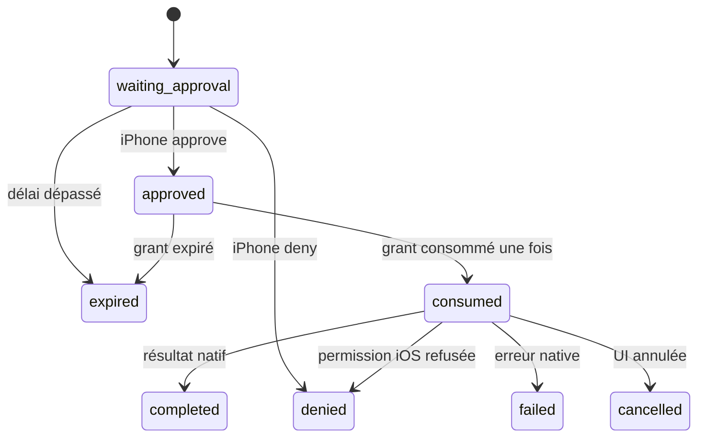

# 10 — iPhone Native Capabilities

> **IMPLEMENTED — slice `0.9.0`:** transport corrélé agent → control plane →
> iPhone pour six capabilities, avec approbation par l'appareil ciblé, grant
> opaque court et consommable une fois, validation native stricte et résultat
> sondable par le worker. La notification initiale transporte seulement les
> métadonnées expurgées nécessaires à l'affichage; les mises à jour ne
> transportent que `request_id`. **PLANNED:** capacités d'écriture
> supplémentaires, push externe et accès direct agent/appareil — ce dernier
> reste volontairement interdit.

> **VALIDATION PENDING:** le code natif et ses contrats automatisés sont livrés,
> mais les dialogues de permission et l'exécution réelle sur iPhone physique
> n'ont pas encore été prouvés. Cette preuve appareil reste distincte d'un test
> unitaire ou d'un build réussi.

## Objectif

Permettre à une job distante de demander une action iPhone sans donner au
worker ni le bearer de l'appareil, ni un accès direct aux API iOS:

```text
Worker avec lease active
  → API agent du control plane
  → Gateway et approbation de l'iPhone ciblé
  → consommation serveur d'un grant à usage unique
  → API native iOS visible
  → résultat corrélé dans SQLite
  → poll du worker avec la même lease
```

## Capabilities implémentées

| Capability | API Expo/iOS | Confirmation | Limite |
|---|---|---|---|
| `iphone.location.current` | Expo Location | approbation monGARS + permission iOS | position foreground ponctuelle |
| `iphone.contacts.lookup` | Expo Contacts | approbation monGARS + permission iOS | 25 résultats, champs minimaux |
| `iphone.calendar.events` | Expo Calendar | approbation monGARS + permission iOS | fenêtre bornée, 100 événements |
| `iphone.photos.pick` | Expo ImagePicker | approbation + picker visible | une photo choisie par l'utilisateur |
| `iphone.mail.compose` | MailComposer | approbation + composeur visible | aucune promesse d'envoi silencieux |
| `iphone.sms.compose` | Expo SMS | approbation + composeur visible | aucune promesse d'envoi silencieux |

Les arguments sont validés par capability. Position et photo n'acceptent aucun
champ; contacts exige `query`; calendrier exige `start < end`; mail accepte au
plus 20 destinataires, un sujet de 500 caractères et un corps de 10 000; SMS
accepte au plus 20 destinataires et 2 000 caractères.

## Endpoints implémentés

### Worker — bearer agent et lease active

| Méthode | Chemin | Effet |
|---|---|---|
| `POST` | `/agents/{agent_id}/jobs/{job_id}/capability-requests` | crée ou retrouve la demande non terminale identique pour cette job/génération |
| `POST` | `/agents/{agent_id}/jobs/{job_id}/capability-requests/{request_id}/poll` | retourne l'état et, s'il existe, le résultat terminal |

La création exige:

```json
{
  "claim_token": "<opaque>",
  "lease_id": "lease_...",
  "lease_generation": 1,
  "capability_name": "iphone.calendar.events",
  "arguments": {
    "start": "2026-09-08T09:00:00-04:00",
    "end": "2026-09-08T17:00:00-04:00"
  }
}
```

La réponse `201` masque les arguments et le grant:

```json
{
  "schema_version": "0.9",
  "request_id": "iphreq_...",
  "task_id": "tsk_...",
  "agent_id": "agt_...",
  "target_device_id": "iphone-main",
  "capability": "iphone.calendar.events",
  "status": "waiting_approval",
  "created_at": "2026-09-08T13:00:00Z",
  "expires_at": "2026-09-08T13:03:00Z"
}
```

Le champ d'enveloppe `schema_version: "0.9"` identifie le schéma du protocole
capability; il est distinct de la version de release/API `0.9.0`.

Le poll exige la même preuve de lease et retourne:

```json
{
  "request_id": "iphreq_...",
  "capability_name": "iphone.calendar.events",
  "status": "completed",
  "result": {
    "name": "iphone.calendar.events",
    "status": "completed",
    "value": []
  },
  "created_at": "2026-09-08T13:00:00Z",
  "expires_at": "2026-09-08T13:03:00Z",
  "completed_at": "2026-09-08T13:00:30Z"
}
```

Une lease étrangère, expirée ou fencée retourne `409`. Le worker doit continuer
son heartbeat pendant l'attente; sinon la demande est annulée avec la lease. La
création est idempotente pour le même `job_id`, la même génération, la même
capability et les mêmes arguments canoniques: un rejeu ou une course retourne le
`request_id` non terminal existant. Des arguments différents créent une demande
distincte.

### iPhone — bearer de l'appareil ciblé

| Méthode | Chemin | Effet |
|---|---|---|
| `GET` | `/iphone/capabilities/requests?limit=100` | liste les aperçus appartenant uniquement à l'appareil |
| `GET` | `/iphone/capabilities/requests/{request_id}` | relit arguments, digest et état autoritatifs; ne reconstitue jamais un grant |
| `POST` | `/iphone/capabilities/requests/{request_id}/authorize` | décide `approve` ou `deny`; une reprise `approve` avant consommation fait tourner le grant |
| `POST` | `/iphone/capabilities/requests/{request_id}/execute` | consomme le grant avant l'appel natif |
| `POST` | `/iphone/capabilities/requests/{request_id}/result` | persiste le résultat natif exact; un rejeu identique retourne `duplicate` |

La décision contient seulement:

```json
{"decision": "approve", "user_note": null}
```

Une approbation retourne le détail et un grant imbriqué:

```json
{
  "schema_version": "0.9",
  "request_id": "iphreq_...",
  "task_id": "tsk_...",
  "agent_id": "agt_...",
  "target_device_id": "iphone-main",
  "capability": "iphone.location.current",
  "status": "approved",
  "created_at": "2026-09-08T13:00:00Z",
  "expires_at": "2026-09-08T13:03:00Z",
  "arguments": {},
  "action_digest": "sha256:...",
  "grant": {
    "schema_version": "0.9",
    "grant_id": "grt_...",
    "request_id": "iphreq_...",
    "task_id": "tsk_...",
    "agent_id": "agt_...",
    "target_device_id": "iphone-main",
    "approval_id": "icapr_...",
    "audit_id": 42,
    "capability": "iphone.location.current",
    "action_digest": "sha256:...",
    "issued_at": "2026-09-08T13:00:05Z",
    "expires_at": "2026-09-08T13:01:35Z",
    "use": "once"
  }
}
```

Le grant est un secret éphémère: seules les réponses `approve` réussies le
contiennent, le serveur ne stocke que son digest, et un `GET` retourne toujours
`grant: null`. Si une réponse est perdue, une nouvelle requête `approve` avant
consommation remplace atomiquement le grant non consommé et invalide l'ancien;
elle ne permet pas de rejouer un grant consommé ou une décision différente.

Avant d'appeler iOS, l'app consomme ce grant:

```json
{
  "grant_id": "grt_...",
  "action_digest": "sha256:..."
}
```

Après consommation, une seconde requête avec le même grant échoue `409`. L'app
exécute ensuite la capability une seule fois et soumet:

```json
{
  "grant_id": "grt_...",
  "action_digest": "sha256:...",
  "result": {
    "name": "iphone.location.current",
    "status": "completed",
    "value": {"latitude": 45.5, "longitude": -73.6, "accuracy": 25}
  }
}
```

Les statuts natifs acceptés sont `completed`, `cancelled`, `denied` et
`failed`. `cancelled` est réservé au picker et aux composeurs; `denied` exige
`permission_denied` ou `unavailable`; `failed` exige `native_error`. Le nom de
capability et la forme de la valeur doivent correspondre au grant.

## État et non-rejeu



Une annulation de tâche ou une perte de lease peut aussi mener toute demande non
terminale à `cancelled`. Les transitions, l'audit et les publications d'outbox
sont commis dans SQLite. Un résultat terminal identique peut être redélivré sans
réexécuter iOS; un résultat différent est refusé. La valeur native validée reste
stockée côté serveur pour le poll du worker; elle est expurgée des payloads
d'audit et du board.

La présence de toute demande de capability pour une génération rend celle-ci
non redistribuable automatiquement après expiration de lease, même si la demande
semble seulement approuvée, consommée ou terminée. Cette règle privilégie
l'absence de double effet lorsque l'issue native est incertaine.

Le transport mobile capture l'origine serveur et le bearer du device au début
du workflow et refuse de poursuivre si l'un change. Il ne persiste ni grant ni
résultat sensible. Les identifiants terminaux servant à dédupliquer les livraisons
WebSocket sont gardés uniquement en mémoire, au plus 256 et pendant 10 minutes.
Après exécution native, un POST de résultat échoué peut être repris dans le même
processus sans reconsommer le grant ni réexécuter iOS. Si l'app meurt avant ce
POST, Ubuntu conserve une issue inconnue plutôt que de rejouer l'action.

## Notifications WebSocket

Les événements ciblés sont:

```json
{"type":"iphone.capability.requested","payload":{"request_id":"iphreq_...","capability_name":"iphone.location.current","expires_at":"2026-09-08T19:15:00Z","preview":{"arguments_redacted":true}}}
{"type":"iphone.capability.updated","payload":{"request_id":"iphreq_..."}}
```

La demande initiale expose seulement l'identifiant, le nom de capability,
l'expiration et la preuve que les arguments sont expurgés. La mise à jour
n'expose que l'identifiant. Aucun des deux événements ne contient arguments,
coordonnées, contacts, contenu de message, résultat natif ou grant. Après
reconnexion, l'app utilise les `GET` REST autoritatifs; le WebSocket n'est pas
une preuve d'autorisation.

## Data minimization

- Contacts: nom et coordonnées demandées, maximum 25 fiches.
- Calendrier: fenêtre explicite, maximum 100 événements.
- Photos: URI et dimensions de l'unique asset choisi; pas de galerie brute.
- Position: acquisition foreground ponctuelle, pas de tracking continu.
- Mail/SMS: composeur visible; aucun succès simulé ni envoi silencieux.

## PLANNED

- création d'événement calendrier et rappels;
- caméra, audio, notifications, document picker et appel téléphonique préparé;
- rétention/expurgation plus fine des résultats sensibles;
- push externe et reprise multi-hôte;
- toute capability supplémentaire, après règle Gateway, schéma, tests et UI
  d'approbation dédiés.
