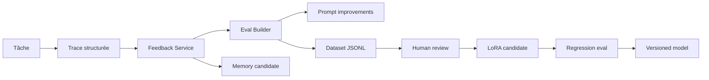

# 11 — Feedback and Training Pipeline

## Objectif

Accumuler de l'information utile assez vite pour améliorer le système, créer des evals, puis préparer un dataset d'entraînement/fine-tuning.

## Sources de feedback

### Feedback explicite

- 👍 / 👎
- “c'était bon”
- “fais ça autrement”
- correction manuelle
- choix d'une option proposée
- approbation/refus permission

### Feedback implicite

- tâche réussie/échouée;
- test qui passe/casse;
- patch accepté/revert;
- temps d'exécution;
- nombre de retries;
- refus modèle normalisé;
- invalid JSON;
- hallucination détectée;
- agent remplacé;
- interruption utilisateur.

## Event schema

Voir `schemas/feedback-event.schema.json`.

Exemple:

```json
{
  "id": "fb_...",
  "task_id": "tsk_...",
  "agent_id": "code-worker-01",
  "type": "task_outcome",
  "score": 0.8,
  "label": "accepted_patch",
  "notes": "Patch appliqué et tests passés",
  "created_at": "..."
}
```

## Dataset types

### Eval dataset

Disponible rapidement.

But:

- tester routing;
- tester parser JSON;
- tester permission gateway;
- tester memory retrieval;
- tester prompt regressions.

Format:

```jsonl
{"input": {...}, "expected": {...}, "tags": ["routing", "code"]}
```

### Preference dataset

But:

- apprendre ton style;
- choisir meilleure réponse;
- améliorer UX.

Format:

```jsonl
{"prompt": "...", "chosen": "...", "rejected": "...", "reason": "..."}
```

### Tool-call dataset

But:

- fine-tuner l'orchestrateur sur les bons tool calls.

Format:

```jsonl
{"messages": [...], "tool_schema": {...}, "expected_tool_call": {...}}
```

### LoRA dataset

But:

- spécialiser Hermes/G9/Dolphin sur monGARS.

Conditions avant entraînement:

- 500+ exemples propres pour petit essai;
- 2 000+ exemples pour résultat plus stable;
- PII nettoyée ou explicitement autorisée;
- split train/validation;
- version dataset;
- eval avant/après;
- rollback.

## Feedback loop



## Scoring agent

Chaque agent reçoit métriques:

- task success rate;
- invalid output rate;
- permission request quality;
- latency;
- user correction rate;
- memory usefulness;
- test pass rate.

## Improvement actions

- modifier prompt;
- modifier routeur;
- ajouter règle de permission;
- enrichir memory retrieval;
- ajuster modèle;
- fine-tuner;
- retirer un agent instable.

## Ce qui ne doit pas arriver

- auto-entraînement live sans revue;
- stockage secrets dans dataset;
- entraînement sur erreurs non labellisées;
- mélange logs bruts + PII;
- écrasement d'un modèle stable sans rollback.
