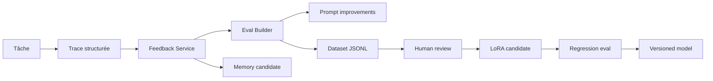

# 11 — Feedback and Training Pipeline

> **IMPLEMENTED — slice `0.12.0`:** le pipeline historique de corrections de
> tâches demeure disponible. Les buts ajoutent feedback terminal, mise à jour du
> score d'épisode et quatre exports JSONL expurgés par rôle: `planner`,
> `evaluator`, `synthesis` et `routing`. **PLANNED:** curation/versionnage des
> jeux, benchmark modèle externe, préférence pairwise et entraînement LoRA. Il
> n'existe aucun auto-entraînement live.

## Objectif

Accumuler de l'information utile assez vite pour améliorer le système, créer des evals, puis préparer un dataset d'entraînement/fine-tuning.

## Sources de feedback

### Feedback explicite

- 👍 / 👎
- “c'était bon”
- “fais ça autrement”
- correction manuelle
- choix d'une option proposée
- approbation/refus permission

### Feedback implicite

- tâche réussie/échouée;
- test qui passe/casse;
- patch accepté/revert;
- temps d'exécution;
- nombre de retries;
- refus modèle normalisé;
- invalid JSON;
- hallucination détectée;
- agent remplacé;
- interruption utilisateur.

## Event schema

Voir `schemas/feedback-event.schema.json`.

Exemple:

```json
{
  "id": "fb_...",
  "task_id": "tsk_...",
  "agent_id": "code-worker-01",
  "type": "task_outcome",
  "score": 0.8,
  "label": "accepted_patch",
  "notes": "Patch appliqué et tests passés",
  "created_at": "..."
}
```

## Dataset types

### Eval dataset

Disponible rapidement.

But:

- tester routing;
- tester parser JSON;
- tester permission gateway;
- tester memory retrieval;
- tester prompt regressions.

Format:

```jsonl
{"input": {...}, "expected": {...}, "tags": ["routing", "code"]}
```

### Preference dataset

But:

- apprendre ton style;
- choisir meilleure réponse;
- améliorer UX.

Format:

```jsonl
{"prompt": "...", "chosen": "...", "rejected": "...", "reason": "..."}
```

### Tool-call dataset

But:

- fine-tuner l'orchestrateur sur les bons tool calls.

Format:

```jsonl
{"messages": [...], "tool_schema": {...}, "expected_tool_call": {...}}
```

### LoRA dataset

But:

- spécialiser Hermes/G9/Dolphin sur monGARS.

Conditions avant entraînement:

- 500+ exemples propres pour petit essai;
- 2 000+ exemples pour résultat plus stable;
- PII nettoyée ou explicitement autorisée;
- split train/validation;
- version dataset;
- eval avant/après;
- rollback.

## Goal datasets v0.12 — IMPLEMENTED

Un appareil jumelé peut noter seulement un but terminal via
`POST /goals/{goal_id}/feedback`. La requête stricte contient:

- un score entre 0 et 5;
- une note optionnelle;
- une correction optionnelle de réponse finale;
- une correction optionnelle de plan;
- le marqueur explicite `reviewed`.

Les textes passent par le sanitizer partagé avant persistance. La ligne de
feedback et son audit sont atomiques. Après commit, le score est projeté dans
l'épisode correspondant quand celui-ci existe; l'échec de cette projection
reconstruisible ne transforme pas un feedback déjà accepté en faux échec.

`FeedbackDatasetService.export_goal_jsonl()` produit un objet JSONL borné par
feedback. Ses filtres indépendants sont `minimum_score`, `successful_only`,
`reviewed_only` et `planner_source`. Les variantes contiennent:

| `dataset_type` | Trajectoire incluse |
|---|---|
| `planner` | critères, nœuds validés et métadonnées d'appels planner |
| `evaluator` | décisions d'évaluation, outcomes de nœuds et appels evaluator |
| `synthesis` | outcomes, résultat agrégé sûr et appels de synthèse disponibles |
| `routing` | affectations worker et preuves expurgées du scheduler |

Chaque record contient objectif, source du planner, profil d'autonomie, outcome,
compteurs, review et provenance/fingerprints. Les charges sont sanitizées
récursivement; secrets, credentials et chemins protégés ne doivent pas entrer
dans l'export. Les résultats bruts de worker ne sont pas des cibles.

`fine_tune_candidate` n'est vrai que si les quatre conditions sont simultanées:

1. le feedback a été marqué `reviewed`;
2. le score est au moins 4;
3. le but est `completed`;
4. une correction humaine adaptée au type de dataset est présente.

Le filtrage d'export n'accorde pas automatiquement ce statut. Un record peut
être exporté à des fins d'eval sans devenir une cible d'entraînement.

### EXPERIMENTAL / PLANNED

- La variante `synthesis` sait exporter une cible corrigée, mais la synthèse
  active v0.12 est déterministe et `summarizer_model` n'est pas routé dans la
  boucle de but.
- Aucun split train/validation, manifeste de version, validation humaine de lot,
  entraînement, comparaison avant/après ou rollback modèle n'est automatisé.
- Les exports JSONL sont une matière première d'eval/curation, pas une preuve de
  qualité du modèle ni une autorisation de déploiement.

## Feedback loop



## Scoring agent

Chaque agent reçoit métriques:

- task success rate;
- invalid output rate;
- permission request quality;
- latency;
- user correction rate;
- memory usefulness;
- test pass rate.

Le score scheduler v0.11 reste séparé du score d'épisode v0.12. Le premier est
calculé depuis les résultats/leases/feedback observés par le serveur. Le second
sert au retrieval de trajectoires et combine outcome, score enregistré et note
utilisateur. Un worker ou un modèle ne peut pas améliorer seul l'une de ces
mesures.

## Improvement actions

- modifier prompt;
- modifier routeur;
- ajouter règle de permission;
- enrichir memory retrieval;
- ajuster modèle;
- fine-tuner;
- retirer un agent instable.

## Ce qui ne doit pas arriver

- auto-entraînement live sans revue;
- stockage secrets dans dataset;
- entraînement sur erreurs non labellisées;
- mélange logs bruts + PII;
- écrasement d'un modèle stable sans rollback.
