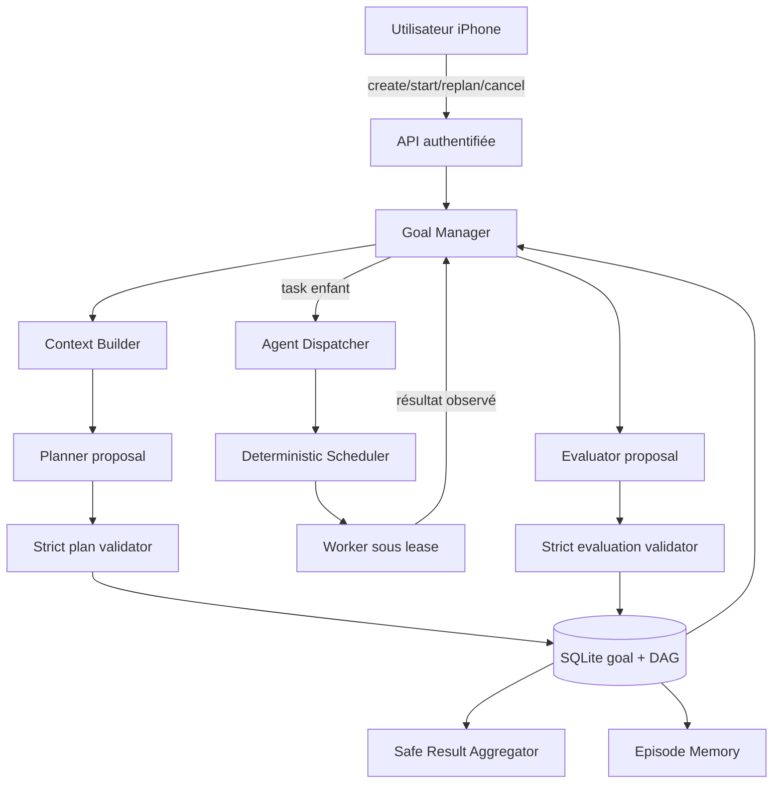

# 28 — Autonomous Swarm Runtime v0.12

## Statut et portée

**IMPLEMENTED:** runtime de buts/DAG borné, contrats planner/evaluator stricts,
tâches enfants worker, budgets, loop guards, agrégation sûre, API authentifiée
et projections mobile.

Depuis l'API v0.13, le worker `code.generate_python` peut aussi produire un
fichier Python proposé. Une revue authentifiée puis l'autorisation unique du
Gateway sont nécessaires avant son écriture. Cette étape ne lance ni ne teste
le programme. Voir [le flux de revue et d'exploitation](29-python-code-proposals.md).

**QUALIFIED:** invariants fonctionnels et de sécurité par tests automatisés
locaux. Les leases, gateways, workers et transports sous-jacents conservent la
qualification bornée v0.11.

**EXPERIMENTAL:** charge/endurance et coordination de plusieurs processus
Goal Manager sur le même but.

**PLANNED:** synthétiseur LLM séparé, nouveaux skills mutateurs avec contrat
d'idempotence, orchestration active-active et workers métier supplémentaires.

Ce runtime ne crée aucun nouveau privilège. Le principe reste:

> Models propose. Gateway decides. Executors act. Ubuntu is authoritative.

## Architecture



Le planner, l'evaluator et un worker ne reçoivent jamais de handle SQLite,
credential d'appareil ou pouvoir de transition. Les mutations passent par les
services code-controlled existants.

## Ressource `goal`

Un but est distinct d'une tâche ordinaire. Sa création atomique produit:

- une tâche racine `planned`;
- un `goal_run` en phase `planning`;
- un objectif immuable pour le plan initial;
- des critères de complétion;
- un profil d'autonomie;
- des limites persistées.

Créer le but ne lance aucun modèle et aucun worker. Une commande `start`
authentifiée est toujours nécessaire.

États de but:

```text
planning -> running -> completed
                   \-> failed
                   \-> waiting_permission -> running
                   \-> cancelled
                   \-> budget_exhausted
```

Les états terminaux ne sont jamais rouverts.

## Contrat du plan

`SwarmPlanProposal` est un objet JSON strict version `1.0` contenant objectif,
résumé de raisonnement, critères, parallélisme et 1 à 20 nœuds. Chaque nœud
contient seulement:

- un ID temporaire;
- `worker` ou `synthesis`;
- titre et objectif bornés;
- skill obligatoire pour `worker`, interdit pour `synthesis`;
- dépendances;
- sortie attendue et priorité;
- préférences d'agent consultatives optionnelles.

Le parser borne la taille, rejette clés dupliquées, constantes non finies,
champs supplémentaires et mauvais types. Le serveur vérifie ensuite:

- objectif lié au but autoritatif: le planner modèle recopie le `card_id`
  `goal:goal_<id>` du contexte, que le serveur vérifie puis remplace par
  l'objectif original; le texte original exact reste accepté pour compatibilité;
- IDs uniques, dépendances connues et graphe acyclique;
- nombre de nœuds et parallélisme dans les budgets;
- skill connu et autorisé par la politique courante;
- aucune contrainte worker sur un nœud de synthèse.

Les champs `status`, `completed`, `result` et `tool_call` ne font pas partie du
contrat. Un modèle ne peut donc pas déclarer son propre succès ou son effet.

Le schéma de génération envoyé au planner et à l'evaluator omet uniquement
`maxLength` sur les chaînes pour contourner une incompatibilité de grammaire
[Ollama/llama.cpp](https://github.com/ggml-org/llama.cpp/issues/25746).
Les contrats Pydantic et OpenAPI conservent toutes leurs limites: chaque réponse
est toujours validée localement avant toute transition. Une réponse trop longue
ou un plan invalide reste rejeté.
Le schéma envoyé pour chaque appel fixe aussi `objective` à la référence exacte
du but via `const`. Les cartes de contexte, épisodes et stratégies ne sont pas
des nœuds et ne peuvent pas devenir des dépendances du plan.

Une proposition locale iPhone ou manuelle est acceptée seulement avec sa source
explicite et subit le même validateur serveur. Elle doit conserver l'objectif
original exact; la référence de carte est réservée à une réponse modèle liée à
son appel serveur. Un autre objectif ou la référence d'un autre but est rejeté,
y compris lors d'une replanification. Le texte retiré par expurgation ou par la
limite de contexte n'a donc jamais à être révélé au modèle pour qu'il puisse
lier son plan au bon but.

Avant une planification automatique, l'API exige au moins un agent d'exécution
`online` déclarant des skills. Sinon le but reste en `planning`, phase
`waiting_for_workers`, sans appel modèle, nœud inventé ou job. Les démarrages
répétés ne consomment pas le budget d'appels; la maintenance reprend après
l'arrivée d'un agent en ligne. Le délai total du but reste applicable. Une
proposition manuelle explicite conserve sa validation et son chemin de dispatch.

## DAG et dispatch

`plan_nodes` et `plan_edges` sont autoritatifs. Une dépendance hard échouée
bloque le descendant; une dépendance optional doit être terminale mais peut
avoir échoué. Les nœuds prêts suivent priorité, date et ID stable.

Chaque nœud worker crée une tâche enfant séparée. Cette isolation préserve
l'invariant «une job distante active par tâche». Le Goal Manager génère
seulement les payloads bornés dont il connaît la sémantique:

- `workspace.list_dir` avec racine relative fixe;
- `research.query` avec requête/taille bornées;
- `code_review.git_status`;
- `code_review.git_diff` avec paths/context fixes;
- `code_review.git_show` sur `HEAD` avec paths/context fixes.

Un autre skill est bloqué jusqu'à ce qu'un mapping de paramètres sûr soit
codé. Après la mise en file, le protocole v0.11 reste inchangé: scheduler
déterministe, credential worker, lease opaque, heartbeat, fencing et résultat
idempotent.

Les nœuds de synthèse ne lancent pas un processus. v0.12 assemble de manière
déterministe les résumés déjà expurgés de leurs dépendances, dans une taille
bornée.

## Profils d'autonomie

| Profil | Comportement v0.12 | Autorité supplémentaire |
|---|---|---|
| `manual` | une nouvelle dispatch au plus par commande utilisateur; les callbacks ne lancent pas le prochain nœud | aucune |
| `assisted` | poursuit les nœuds prêts après le démarrage initial et les preuves worker | aucune |
| `autonomous` | même boucle bornée actuelle que `assisted`, avec mode de tâche racine autonome | aucune |

Ces profils règlent le rythme, pas les permissions. Toute approval, capability,
policy, lease, sandbox et limite reste identique.

## Budgets et arrêt des boucles

Chaque but persiste:

- `max_steps` et `step_count`;
- `max_parallelism` (maximum global 3);
- `max_replans` et `replan_count`;
- `max_runtime_seconds`;
- `max_model_calls` et `model_call_count`.

Le runtime réserve un appel modèle avant le transport et refuse un second appel
simultané pour le même but. Le temps et les compteurs sont relus depuis SQLite
avant les mutations importantes. Une limite consommée termine le but en
`budget_exhausted` ou refuse l'extension.

Les fingerprints ignorent la prose explicative et couvrent les sémantiques du
plan ou de l'évaluation. Un replan équivalent est stoppé. Une même décision
evaluator sur le même fingerprint d'état est stoppée comme boucle sans progrès.
La décision evaluator, son fingerprint, la fin fenced de l'appel modèle et son
effet d'état sont écrits dans une seule transaction. Une panne après commit peut
retarder les projections de résultat/épisode, mais ne laisse jamais un verdict
durable non appliqué et ne permet pas à un replan concurrent d'ajouter du travail
à un but déjà terminé.

## Evaluator

L'evaluator Ubuntu reçoit un `GoalEvaluationContext` strict et borné:

- objectif et critères;
- résultat résumé/erreur/statut de chaque nœud;
- IDs connus;
- budgets restants et temps écoulé;
- fingerprint d'état.

Sa décision peut être `continue`, `replan`, `done`, `failed` ou `needs_user`.
`needs_user` exige une question; les décisions terminales ne peuvent pas ajouter
de nœuds. Toute suggestion repasse par le validateur de DAG et de skill.

`done` n'est pas une preuve. Le Goal Manager exige au moins une preuve worker
complétée avant d'accepter la fin. Un résultat `null`, vide ou non conforme au
contrat du skill termine le nœud en échec même si le worker annonce
`completed`. Sans preuve valide, le but échoue fermé.
Une indisponibilité du planner/evaluator laisse une phase récupérable et ne
fabrique aucun résultat.
Le diagnostic distingue transport indisponible (`planner_unavailable`), requête
refusée (`planner_request_rejected`), réponse invalide (`planner_invalid_response`)
et contexte invalide (`planner_invalid_context`). Les raisons publiques sont
fixes et ne contiennent pas la réponse brute du modèle. La clôture de l'appel
et ce diagnostic sont atomiques et soumis au bail de l'appel: une réponse
tardive ne peut pas écraser une reprise plus récente.
Après chacun de ces échecs du planner, la maintenance attend au moins 60 secondes
depuis la dernière modification persistée avant un nouvel essai automatique.
Ce délai survit au redémarrage et s'applique avant la limite de sélection des
buts. Un démarrage explicitement demandé peut réessayer immédiatement si le
budget le permet. Quand le budget d'appels est épuisé, le but passe à
`budget_exhausted`; son historique et ses limites ne sont pas réinitialisés.

## Résultat et provenance

`ResultAggregator` relit les nœuds et jobs depuis SQLite. Il sanitise et borne
les résumés, calcule les comptes, ajoute les IDs d'agent/job/skill et digests
disponibles, puis écrit `goal_results`. Un JSON worker malformé ou une valeur
sensible n'est pas reflété tel quel.

Le résultat public contient réponse, nœuds terminés/échoués, agents utilisés,
limitations et timestamps. Les `memory_ids`/`episode_ids` proviennent seulement
des sources effectivement retenues dans les contextes persistés.

## API et mobile

Surface authentifiée:

```text
POST /goals
GET  /goals
GET  /goals/{goal_id}
POST /goals/{goal_id}/start
POST /goals/{goal_id}/cancel
POST /goals/{goal_id}/replan
GET  /goals/{goal_id}/nodes
GET  /goals/{goal_id}/result
POST /goals/{goal_id}/feedback
```

L'app Expo expose une liste Swarm et un détail de but. Elle peut créer, démarrer,
replanifier, annuler et noter seulement après un bootstrap autoritatif. Le cache
SQLite mobile conserve buts, nœuds et résultats dans la partition de l'origine;
hors ligne, la vue est explicitement périmable et toutes les commandes sont
désactivées. Les événements WebSocket sont des invalidations sûres et imposent
une relecture REST.

## Reprise et limites

Au démarrage, la réconciliation rattache les jobs enfants persistés, projette
leurs états observés et ne fait progresser automatiquement que les buts
`assisted` ou `autonomous` encore actifs. Elle ne rejoue aucun effet natif ou
worker incertain; un but `manual` attend toujours une nouvelle action explicite.

Restent non qualifiés:

- coordination active-active d'un même but entre plusieurs processus;
- performance/endurance avec de nombreux buts et modèles concurrents;
- synthèse LLM et routage dynamique par rôle;
- nouveaux workers mutateurs;
- iPhone physique, Redis TLS et topologie workers multi-machine, qui gardent les
  statuts de `docs/27-production-qualification.md`.
