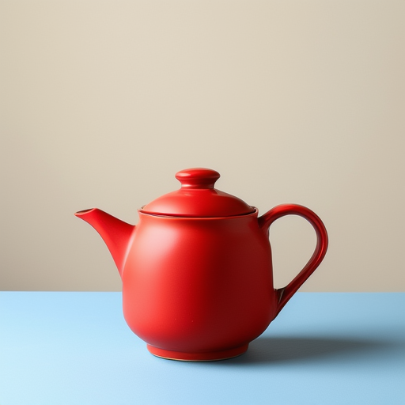

# Chroma1-HD on RTX 2070: complete image qualification

Qualification completed on 2026-10-02, Montreal time. This is direct local inference on Ubuntu, not a Swarmer application API test or deployment. Two complete image generations succeeded, with an intentional cancellation between them. The recovered run produced exactly the same pixels as the baseline.

## Reproducible inputs

The native CUDA runtime is the [previously qualified SM75 build](chroma-runtime-2026-10-02.md): stable-diffusion.cpp `3f8527a46c54ecf4cb4ed6003da8e8982283c73c`, GGML `89c4413f5da6fb20cc796f16033d37f129be81fd`. Its SHA-256 is `3e3f105d52840e06dd133c862abd5c6895c2d974abf92e9487b963b5decfa6cf`.

All three downloaded files matched their pinned upstream sizes and SHA-256 values. Full identities and verified local paths are in [verified-models.json](chroma-inference-2026-10-02/verified-models.json).

| Component | Repository / revision | File | Bytes |
|---|---|---|---:|
| Diffusion | `silveroxides/Chroma1-HD-GGUF` / `d3b77bf4eb5b84c0b50e9a1e83f6e8074ed85f82` | `Chroma1-HD-Q4_K_M.gguf` | 5,566,533,792 |
| Text encoder | `city96/t5-v1_1-xxl-encoder-gguf` / `005a6ea51a7d0b84d677b3e633bb52a8c85a83d9` | `t5-v1_1-xxl-encoder-Q5_K_M.gguf` | 3,386,856,640 |
| VAE | `lodestones/Chroma` / `2f3b2730d7b5edbd02cdff12f72610af5787300b` | `ae.safetensors` | 335,304,388 |

Total model download: 9,288,694,820 bytes. The files remain local and read-only. Generation containers have no network access.

## Generation recipe

512 × 512 pixels, batch 1, seed 42, Euler, 40 steps, CFG 3, diffusion flash attention enabled. Diffusion computes on CUDA0; T5 and VAE compute on CPU. The managed CUDA budget is 6.5 GiB, which is not a hard limit on whole-device usage.

The Flux scheduler uses `base_shift=1.0986122886681098,max_shift=1.0986122886681098`. Fixing both endpoints to `ln(3)` matches the author's fixed flow shift of 3 in the pinned implementation. No SageAttention, forced global weight dtype or altered HD attention mask is used. See the [pinned scheduler implementation](https://github.com/leejet/stable-diffusion.cpp/blob/3f8527a46c54ecf4cb4ed6003da8e8982283c73c/src/runtime/denoiser.hpp) and [model scheduler configuration](https://huggingface.co/lodestones/Chroma1-HD/blob/0e0c60ece1e82b17cb7f77342d765ba5024c40c0/scheduler/scheduler_config.json).

Prompt:

> A studio product photograph of one small matte red ceramic teapot, centered on a pale blue table, soft window lighting, a plain cream background, realistic ceramic texture, clean composition, no text, no watermark.

Negative prompt: `blurry, low quality`.

The first run leaves automatic weight placement enabled. Its persistent diffusion weights are allocated in host RAM, then staged to CUDA0 once for sampling. The later runs add only `--params-backend diffusion=cuda0,te=cpu,vae=cpu` to the generation recipe, placing the diffusion weights directly on CUDA0. All image parameters remain identical. Explicit parameter placement disables automatic placement; this choice is qualified only for this workload. [Pinned backend documentation](https://github.com/leejet/stable-diffusion.cpp/blob/3f8527a46c54ecf4cb4ed6003da8e8982283c73c/docs/backend.md).

## Results

| Run | Outcome | Wall time | Text encoding | Sampling | CPU decode |
|---|---|---:|---:|---:|---:|
| `first-512` | Complete PNG, exit 0 | 262.223 s | 56.53 s | 178.70 s | 24.29 s |
| `cancel-512` | Intentional cancellation, exit 143, no output image | 97.052 s | 53.89 s | Interrupted | Not reached |
| `recovery-direct-512` | Complete PNG after cancellation, exit 0 | 247.920 s | 54.73 s | 164.86 s | 25.75 s |

The first image is a valid RGB PNG, 512 × 512, 352,411 bytes. Visual inspection confirms a single red teapot, pale blue tabletop and cream background, without visible text or watermark. The surface has glossy highlights despite the requested matte finish; this is a successful generation, not perfect compliance with every material adjective.

The first run's sampled whole-device VRAM peak is 6,207 MiB. Its container cgroup memory peak reaches the 12 GiB cap, with reclaim-limit events but no OOM. This metric includes charged file cache and is not process RSS. The host's minimum sampled available RAM is 7,526,612 KiB; maximum sampled swap use is 1,920,304 KiB. Host swap is system-wide and must not be attributed entirely to this process. The container itself has no additional swap allowance.

The cancellation run is intentionally stopped after its 95-second threshold, during CUDA computation. `docker stop` returns in 0.323 seconds; the container exits with SIGTERM status 143, produces no PNG, and is removed. A subsequent independent probe finds no Chroma CUDA process or container, with whole-device VRAM back to 356 MiB. Before this cancellation test, the same checks after the successful baseline found 358 MiB and a healthy backend. These independent command observations are retained in [cleanup-checkpoints.json](chroma-inference-2026-10-02/cleanup-checkpoints.json).

The full direct-placement recovery run succeeded in 247.920 seconds. The decoded pixels and the entire PNG file are identical to the baseline. Both PNG files have SHA-256 `3beb76f45ac9a58137450633012582726f662e8b2ca9e59dbb33ebe9a97b1f69`; decoded RGB pixels have SHA-256 `90b04ccd9c4e59fc006862972eb972e6efca62cfe268a3b211c9886a10f2cb60`.

| Resource observation | Baseline | Cancelled direct placement | Full direct placement |
|---|---:|---:|---:|
| Sampled whole-device GPU peak | 6,207 MiB | 6,151 MiB | 6,177 MiB |
| Container cgroup memory peak | 12.000 GiB | 9.923 GiB | 7.425 GiB |
| Last sampled memory-limit events (`max`) | 3,883 | 0 | 0 |
| OOM kill | No | No | No |
| Maximum sampled GPU temperature | 81 °C | 71 °C | 80 °C |

Direct placement removes the persistent 5,308.62 MiB host diffusion-weight allocation in the renderer log. The observed cgroup reduction and small timing improvement are not a controlled benchmark of placement alone: warmed files, cache charging and desktop activity also differ. In particular, the two direct-placement runs themselves have different cgroup peaks. System-wide swap reaches 3,155,336 KiB during recovery; the minimum available host RAM remains 14,311,400 KiB. No container memory-limit events are recorded in either direct-placement run. The full decoded image comparison and computed metrics are in [summary.json](chroma-inference-2026-10-02/summary.json).

The [final independent health probe](chroma-inference-2026-10-02/final-health.json), at `2026-10-03T02:49:16Z`, confirms HTTP 200 with backend status `ok`, all six services active, no Chroma container or CUDA process remaining, no resident Ollama model, and 360 MiB whole-device VRAM usage. The existing desktop GPU process remains present.

## Isolation, monitoring and limitations

Each run uses the existing pinned CUDA container image, read-only runtime/model mounts, a dedicated output directory, no network, dropped capabilities, no-new-privileges, the user's UID/GID, a six-CPU-equivalent quota (not CPU pinning), four renderer threads, a 12 GiB memory limit, and a 900-second runtime deadline. The [qualification supervisor](chroma-inference-2026-10-02/qualification.py) checks active production model/worker leases and Ollama residency before launch and during execution; it stops only its own container if production work appears. This is a polling qualification guard, not an atomic production GPU reservation.

Telemetry is sampled approximately every 2–3 seconds. GPU figures describe the whole card, including desktop activity. Container memory peaks come from the kernel cgroup counters as sampled while it runs. Timing includes startup and supervisor polling overhead; phase timings come from the renderer log.

Docker delayed publishing the carriage-return-only denoising progress until the terminating newline. An initial interpretation that the first step had not completed was incorrect. The complete log records 40 progressing steps, with a first step of 9.09 seconds and subsequent steps around 4.0–4.7 seconds. This run does not show a CUDA hang.

The production API and workers were not restarted or deployed. This test does not establish higher-resolution performance, arbitrary prompt quality, universal content behavior, or Chroma support in the application. The existing media adapter targets SDXL; a separate Chroma profile and integration remain necessary.

Full commands, model identities, samples and output hashes are preserved in the per-run `request.json`, `runtime.log` and `receipt.json` under [chroma-inference-2026-10-02](chroma-inference-2026-10-02/).
