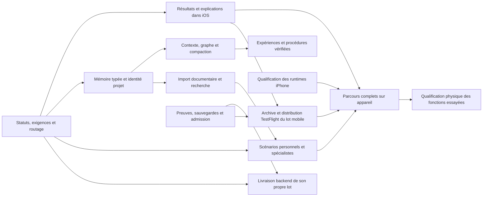

# monGARS — plan consolidé des corrections et engagements

Date : 28 septembre 2026. Base examinée : `main`, `b1c365a`.

Avancement séparé : [lots d’implémentation et preuves locales du 29 septembre UTC](implementation-progress-2026-09-29.md). Le registre ci-dessous conserve les constats de départ ; consulter ce relevé avant de présenter un point comme inchangé ou déjà livré.

Direction mémoire affinée après le cadre fourni par l’utilisateur : [autorité SQL, preuves versionnées, index hybrides et protocole de qualification](evidence-backed-memory-2026-09-29.md). Ce complément relie les décisions aux travaux M01–M12 et sépare les implémentations locales des étapes encore proposées.

**Ce document prépare le travail. Il ne constitue ni une implémentation, ni une autorisation de relancer les projets existants, ni une preuve de déploiement.** Il consolide la conversation, les captures, les audits du jour, les preuves du dépôt et les préférences mémorisées. Les fichiers des projets utilisateur restent intacts.

## Direction à conserver

monGARS doit devenir un assistant personnel capable de rechercher, comprendre des documents, organiser, gérer des données et réaliser des projets, avec des agents spécialisés et une mémoire exploitable. Le codage est une capacité parmi les autres.

L’utilisateur doit pouvoir comprendre la demande retenue, le travail en cours, les raisons explicites des décisions, les résultats et les limites. Une API commune doit porter les contrats utilisés par l’interface et l’automatisation. L’affichage, les souvenirs et les évaluations ne doivent jamais transformer une annonce du modèle en preuve d’exécution.

## Lecture des priorités et des états

- **P0** : fausse réussite, résultat inutilisable ou mauvais parcours ; première livraison corrective.
- **P1** : fiabilité, mémoire, capacités centrales et validation réelle.
- **P2** : extension fonctionnelle, ergonomie ou exploitation après stabilisation des fondations.
- **Constaté** : défaut observé dans l’audit du jour ou le code actuel, avec une portée indiquée.
- **Partiel** : une base existe ; raccordement, configuration ou qualification encore nécessaire.
- **À qualifier** : correction ou fonctionnalité documentée, sans preuve suffisante pour le parcours complet demandé.
- **À réaliser** : engagement non livré identifié dans la conversation ou les documents.
- **À investiguer** : incident ou limite documentée dont la cause ou la présence actuelle reste à établir.

Une preuve datée d’un ancien déploiement n’établit pas l’état actuel de tous les composants. Le backend observé aujourd’hui est `c48f403…`, version `0.14.2`, schéma 27. La dernière preuve de distribution consultée concerne TestFlight `0.1.0 (20260928030500)` ; elle ne prouve pas les essais physiques de toutes les fonctions.

## Engagements qui ont été laissés incomplets

1. Mémoire générale et par projet réellement utile à tous les rôles, avec apprentissage des expériences vérifiées.
2. Import d’URL, PDF et textes jusqu’à une bibliothèque consultable et citée.
3. Assistant personnel : agenda, documents, CRM, données et intégrations utilisables, au-delà d’un catalogue.
4. Complétion fiable d’un projet bénin de bout en bout, sans boucles de lectures ni faux « terminé ».
5. Ensemble de modèles cohérent avec les choix demandés, qualifié par rôle ; nettoyage seulement après remplacement réussi.
6. Qualification des trois runtimes iPhone et des embeddings locaux, stockage durable et orchestration locale explicites.
7. Couverture API des fonctionnalités, suivi compréhensible et cohérence de navigation sur toute l’application.
8. Comparaison des palettes et validation de la refonte visuelle complète, pas seulement création d’illustrations.
9. Export du code régénéré et lisible, en parties inférieures à 5 000 000 octets.

## Registre des travaux

Le registre contient **57 travaux identifiés**, répartis en huit domaines. Chaque identifiant désigne un travail distinct. « Sortie » indique la preuve nécessaire pour le fermer. Les colonnes ne constituent pas des mesures de durée.

### A — Résultats, demandes et orchestration

| ID | Priorité / état | Travail et constat | Sortie attendue |
|---|---|---|---|
| F01 | P0 · Constaté | Remplacer le contrat fixe du rédacteur — 100–140 mots, 512 tokens, prose sans tableau — par un livrable borné adapté à la demande. Le test demandait 150–200 mots, la note en contient 55 ; une troncature n’est pas établie. | Longueurs, tableaux et plans FR/EN respectés ; réserve pour le JSON ; documents longs découpés avec critères conservés ; impossibilité explicitée et sortie tronquée toujours rejetée. |
| F02 | P0 · Constaté | Vérifier les exigences mesurables avant `completed` : longueur, sources officielles, nombre de citations, livrables et contrôles adaptés. Le juge a accepté une note non conforme. | Le cas de 55 mots/une source officielle échoue malgré un juge `done` ; un cas conforme réussit ; pertinence des sources également évaluée. |
| F03 | P0 · Constaté | Distinguer livrable, clarification utile, sources insuffisantes, refus explicite et erreur technique. Le rédacteur n’offre actuellement que `delivered`/`declined`. | Une question précise rejoint une attente utilisateur liée à sa réponse ; une réponse vague reste invalide ; un refus réel conserve son état distinct ; aucune reprise infinie. |
| F04 | P0 · Constaté | Aligner « Confier une tâche » dans Chat et le parcours Projets. Une URL SQLite a été envoyée à `workspace.list_dir`. | Même intention de recherche correctement routée depuis les deux entrées ; aucune URL interprétée comme chemin local ; contexte et autorisations conservés. |
| F05 | P0 · Constaté | Présenter le document demandé dans Résultats, avec accès direct, citations et contrôles. Le bilan technique masque aujourd’hui la note du test. | L’utilisateur ouvre et copie la note depuis Résultats sans chercher dans Plan ; « aucun fichier demandé » reste différent de « aucun résultat ». |
| F06 | P1 · À qualifier | Qualifier une réalisation autonome complète sur un CRM bénin Python/SQLite et une petite application Swift. Le CRM guidé 30B a réussi ses 12 tests indépendants ; ce n’est pas une preuve d’autonomie générale. | Partir d’un projet vide sans guidage fichier par fichier ; création → modification → tests → reprise → résultat ; critères figés avant essai, contrôles négatifs et persistance réelle ; rapport par tentative, sans généraliser un seul succès. |
| F07 | P1 · Partiel | Consolider la gestion des délais, réponses incomplètes, lectures répétées, opérations sans effet et budgets. Des protections existent ; la stratégie de reprise reste à mesurer. | Détecter l’absence de progrès, changer de sous-tâche ou demander une information précise ; conserver les fichiers et compter chaque appel ; pas de simple augmentation aveugle des budgets. |
| F08 | P1 · Constaté | Vérifier couverture et pertinence des recherches ; distinguer sources disponibles et citations utilisées. Le worker annexe parfois des liens à une clarification ; SearXNG renvoie des extraits, sans lire les pages. | Couverture officielle Python et SQLite contrôlée ; recherche complémentaire bornée si nécessaire ; lecture de page dédiée quand requise ; passages réellement consultés cités, aucune bibliographie présentée comme preuve d’analyse. |
| F09 | P1 · Partiel | Rendre les budgets compréhensibles par planification, rédaction, code, embedding et compaction. Génération et embeddings partagent aujourd’hui un compteur d’appels. | Sous-compteurs et réservation prévisionnelle concordants ; reprise sans double facturation ; coût antérieur conservé après « Continue » ; limite globale respectée sous concurrence, prochaine action utile en cas de pause. |

Preuves : [audit mémoire et rédaction](../research/advanced-memory-context-2026-09-28.md), [contrat du worker](../../workers/text-worker/text_worker.py), [contrats rédaction](../../server/app/services/writing_contracts.py), [continuation corrigée](../evidence/planner-continuation-context-2026-09-28.md), [opérations par lots](../evidence/project-operation-batches-2026-09-28.md), [qualification CRM](../evidence/crm-repair-2026-09-22.md).

### B — Mémoire, contexte et connaissances

| ID | Priorité / état | Travail et constat | Sortie attendue |
|---|---|---|---|
| M01 | P1 · Constaté | Relier chaque parcours à une identité de projet durable. Le test recherche/rédaction n’a pas utilisé la mémoire vectorielle de projet. | Chat, recherche, rédaction et code retrouvent le bon projet ; aucun mélange entre projets ou origines. |
| M02 | P1 · Constaté | Extraire exigences, décisions, préférences et observations utiles avec provenance. La mémoire générale n’a qu’une entrée et aucun rédacteur automatique de faits utiles. | Souvenir observable, lié à sa source et son statut ; une annonce assistant ne devient pas un fait vérifié ; corrections versionnées. |
| M03 | P1 · Constaté | Dédupliquer l’index utile et la récupération. Le plus gros projet contient 249 vecteurs pour 70 textes ; les derniers appels reçoivent quatre copies identiques. | Les résultats transmis sont distincts et pertinents ; occurrences originales conservées dans l’historique. |
| M04 | P1 · Constaté | Unifier et rendre explicites les fournisseurs d’embeddings et chemins de recherche. Projets vectorisés, général/épisodes non vectorisés ; FAISS hors du parcours observé. | Diagnostic par portée, fournisseur, dimensions et révision ; récupération mesurée ; reconstruire l’index sans perdre les sources. Ne pas changer de moteur pour son seul nom. |
| M05 | P1 · Partiel | Vue Mémoire unifiée : général, projets, épisodes, documents et éléments utilisés. L’écran ne montre que le général, annonce toujours « lexical », et le diagnostic serveur décrit surtout le provider projet. | Affichage lexical/hybride/repli fondé sur le reçu réel ; configuration distinguée d’un test réussi ; mémoire vide dans une portée jamais interprétée comme système entier vide ; provenance, correction et usages consultables. |
| M06 | P1 · Partiel | Contrat durable du projet et graphe reliant demande, exigences, décisions, actions, livrables et preuves. Les associations de preuves existantes ne couvrent pas cette totalité. | Correction utilisateur conservée ; chaque exigence indique sa couverture et ses preuves actuelles ; liens obsolètes restent historiques. |
| M07 | P1 · Partiel | Qualifier puis activer la compaction versionnée et les contextes de projet optionnels. Mesurer les tokens par modèle et gérer les modifications concurrentes. | Contraintes et questions ouvertes préservées ; accès aux originaux ; conflit de version détecté ; budget insuffisant explicite avant appel. |
| M08 | P1 · Partiel | Import URL/PDF/TXT/Markdown/DOCX : dépôt iPhone, extraction, versions, découpage, embeddings, citations et état d’import. L’extracteur actuel lit un chemin local ; Docling n’est pas actif dans le parcours observé, son environnement worker doit être vérifié avant activation, OCR désactivé dans l’adaptateur. | Corpus FR/EN avec tableaux et fichiers malformés ; PDF scanné traité ou limite explicite ; pages/sections citables ; import répété sans duplication ; source mise à jour et suppression répercutées ; processus d’extraction borné et annulable. |
| M09 | P1 · Partiel local | Expériences et leçons fondées sur des reçus, avec domaine d’application, contre-exemples et invalidation. Le [registre conditionnel au schéma 34](../evidence/memory-conditional-lessons-2026-10-04.md) conserve une sélection explicite de preuves ; il n'est pas déployé. | Une fausse réussite antérieure ne devient pas une recommandation ; producteur réel qualifié, transmission aux workers et procédure candidate testée avant promotion restent à démontrer. |
| M10 | P1 · Constaté | Assembler un contexte par rôle avec reçu exact : rédaction limitée à 12 échanges, chat ordinaire à 40. Les guides AGENTS existent ; `focus_paths` réduit le prompt mais transporte encore le snapshot complet. | Consigne ancienne et correction récente conservées ; lecture à la demande par fichier/plage/hash/révision ; guides humains distincts des notes générées ; contexte d’une autre révision refusé ; omissions et coûts mesurés. |
| M11 | P1 · Partiel | Portées, confidentialité, rétention et oubli cohérent entre sources, résumés, faits et index. | Aucun contenu privé d’un autre projet ; suppression effective des dérivés ; promotion générale explicite ; conservation historique compatible avec l’effacement demandé. |
| M12 | P1 · Constaté | Fiabiliser l’indexation incrémentale : changement du seul résumé général sans réindexation, absence de backfill automatique et recherche hybride pouvant omettre les correspondances lexicales sans vecteur. | Modifier le résumé invalide/recalcule le vecteur ; backfill reprenable ; résultat lexical conservé sans embedding ; import partiel ne supprime pas les autres sources ; modèle/dimension/révision incompatibles détectés. |
| M13 | P2 · À réaliser | Donner un usage produit aux embeddings iPhone si une mémoire hors ligne est retenue. E5 fournit actuellement un panneau expérimental ; le plan local sait déjà lire la mémoire serveur. | Décision explicite sur le besoin hors ligne, puis index et lecteur locaux avec portée/synchronisation ; requête FR/EN retrouve une source réellement importée ; aucun mélange E5-384/embeddinggemma-768 ni modification implicite de l’index serveur. |

Architecture, sources de recherche et tests détaillés : [mémoire avancée](../research/advanced-memory-context-2026-09-28.md). Bases existantes : [ContextBuilder](../29-context-engineering.md), [épisodes](../30-episodic-memory.md), [état et synchronisation](../08-state-memory-sync.md).

Points d’entrée pour M12 : [index général et recherche](../../server/app/services/state_service.py), [index projet](../../server/app/services/project_memory.py). Les constats de volumes proviennent de l’instantané du 28 septembre ; ils ne décrivent pas tous les projets futurs.

### C — Assistant personnel, agents et outils

| ID | Priorité / état | Travail et constat | Sortie attendue |
|---|---|---|---|
| P01 | P1 · Constaté | Aligner catalogue, documentation et disponibilité réelle : 13 domaines, 30 rôles, 94 compétences, dont 19 de type worker, 12 iPhone et 63 prévues. Ces types n’établissent pas l’activation. | Distinguer rôle, modèle, worker connecté et outil exécutable ; raison précise d’indisponibilité ; catalogue wheel/API/app concordant et aucun outil présenté comme opérationnel par son seul nom. |
| P02 | P1 · Partiel | Rendre le spécialiste SQLite utilisable dans les parcours voulus : schéma, requêtes, migrations et preuves. | Création et évolution d’une base de test, sauvegarde, vérification et reprise ; outils enregistrés et résultats visibles. |
| P03 | P1 · Partiel | Activer et qualifier agenda, documents et CRM. Les contrats natifs Agenda/Rappels et `crm.command` existent ; activation et parcours réels restent distincts. | Agenda : droits accordés/révoqués, fuseaux, changement d’heure et lecture après écriture ; CRM : persistance et retry sans double création. Récurrence, journée entière, suppression et envoi de courriels hors périmètre actuel clairement signalés. |
| P04 | P2 · Partiel | Raccorder les fournisseurs externes nécessaires : calendriers, contacts, documents, CRM, courriel. Identifier précisément ce qui exige un compte ou une configuration. | Lecture/écriture testées sur comptes de test ; aperçu et accords appropriés ; aucun envoi automatique déduit d’une demande de préparation. |
| P05 | P1 · Partiel | Qualifier Python, Swift, architecture et qualité avec leurs outils réels. La proposition Python syntaxique ne remplace pas le runtime projet ; Swift snapshots/build/XCTest existe, Swift Testing-only reste non couvert. | Images et hashes du runtime prouvés ; test exécuté, échoué, ignoré et zéro test distincts ; révision Swift compilée égale à celle autorisée ; support Swift Testing ajouté ou limite explicite ; rôle qualité relié aux critères initiaux. |
| P06 | P2 · À réaliser | Faire des intégrations et automatisations un parcours utilisable : déclencheur, action, résultat, suspension et historique. Les outils unitaires ne constituent pas encore un assistant personnel automatisé complet. | Scénario récurrent bénin sur données de test, déduplication après redémarrage, annulation effective et reçus visibles ; actions externes respectant les autorisations précises de l’utilisateur. |

Références : [assistant personnel](../evidence/personal-assistant-2026-09-22.md), [catalogue](../activity-catalog.md), [routage entre agents](../evidence/general-agent-routing-2026-09-24.md), [guidance et Swift](../evidence/project-guidance-swift-2026-09-22.md).

### D — iPhone, modèles locaux et API

| ID | Priorité / état | Travail et constat | Sortie attendue |
|---|---|---|---|
| N01 | P1 · À qualifier | Vérifier E5 sur le build actuel. Le correctif BERT/tokenizer et la séparation génération/embedding sont déjà dans le code ; l’ancienne capture ne prouve pas leur échec actuel. | Chargement et vecteurs réels sur iPhone : 384 dimensions finies, normalisation et préfixes query/passage corrects ; pertinence FR/EN ; annulation/déchargement/reprise sans crash et conflit avec génération géré. |
| N02 | P1 · À qualifier | Qualifier les presets Core ML, MLX et GGUF avec leurs formats et réglages réels. Core ML dispose d’un adaptateur mais pas d’une preuve complète de génération sur l’appareil actuel. | Télécharger/importer, charger, générer, décharger, relancer ; mesure mémoire/latence/qualité ; résultats séparés par runtime et version. |
| N03 | P1 · À qualifier | Prouver plan local iPhone → validation → soumission → agents Ubuntu. La lecture de mémoire/contexte serveur existe déjà dans le contrôleur local partagé. | Plan structuré réellement produit localement ; contexte inchangé vérifié avant soumission ; provenance du modèle conservée, soumission explicite unique et résultat backend corrélé. |
| N04 | P1 · À qualifier | Revalider le stockage durable déjà livré : `Documents/Models`, index et SQLite privés, migration et conservation de l’outbox. Une copie MLX durable a une preuve physique historique. | Mise à jour sans désinstallation ; modèle présent hors ligne et après déchargement/redémarrage ; fichier déplacé/corrompu détecté ; migration interrompue sans perte ; aucune base ou secret dans Fichiers. |
| N05 | P1 · À qualifier | Étendre les deux petits essais CPU historiques après premier token : achèvement de 16 tokens et annulation. Préfill froid, verrouillage, longue durée et pression mémoire restent à qualifier. | Sur le build courant, calcul admis continue ou s’arrête proprement à expiration ; aucun nouveau calcul en arrière-plan ; listener refermé en fin de tâche ; état exact, aucune promesse de serveur iOS permanent. |
| N06 | P1 · Partiel | Mesurer la couverture de l’API commune UI/automatisation. Son transport HTTPS local est Debug seulement, absent de TestFlight ; les reçus locaux de jobs sont en mémoire et perdus au redémarrage. | Contrats versionnés et erreurs/authentification testées ; réconciliation avec les effets serveur avant toute reprise ; besoin de reçus durables et de transport produit décidé explicitement ; pas d’ouverture implicite du listener Debug en Release. |
| N07 | P1 · À qualifier | Parcours physique de jumelage, reconnexion IPv6, Wi-Fi/LTE, hors ligne, cache et retour au premier plan. | Aucun changement d’origine ou cache périmé présenté comme état frais ; brouillons conservés ; limites du tunnel de développement distinguées de l’accès au backend. |
| N08 | P1 · À réaliser | Ajouter le téléchargement explicite du bundle Core ML épinglé et de ses sidecars. L’interface propose aujourd’hui seulement l’import d’un dossier ; réutiliser le stockage existant. | Progression, annulation, réserve disque et intégrité vérifiées ; installation atomique ; interruption ne produit pas un faux modèle prêt ; réutilisation hors ligne ; bundle téléchargé équivalent au bundle importé, puis qualification N02. |

Références : [API applicative](../25-application-api.md), [API sur appareil](../evidence/application-api-2026-09-16.md), [arrière-plan](../evidence/iphone-background-cpu-2026-09-20.md), [modèles](../../configs/model-manifest.yaml), [essai local historique](../evidence/iphone-mlx-crm-2026-09-13.md), [crash et correction](../evidence/ios-launch-crash-2026-09-23.md).

Code des distinctions à préserver : [validation E5](../../mobile/modules/swarmer-local-inference/ios/EmbeddingValidation.swift), [type d’usage du modèle](../../mobile/modules/swarmer-local-inference/ios/LocalModelPurpose.swift), [écran des modèles](../../mobile/app/local-model.tsx), [migration de la base privée](../../mobile/src/lib/state/database-location.ts).

### E — Interface, navigation et compréhension

| ID | Priorité / état | Travail et constat | Sortie attendue |
|---|---|---|---|
| U01 | P2 · Partiel | Comparer des palettes et compositions sur les mêmes vrais écrans ; appliquer une identité cohérente à toute l’app. Le vert sombre a été conservé en attendant ce choix. | Variantes Assistant/Projet/Mémoire/Réglages comparables, contraste et lisibilité vérifiés ; choix appliqué aux composants et assets. |
| U02 | P1 · Partiel | Simplifier le parcours discuter/confier/créer/reprendre/démarrer, conserver le contexte et regrouper les doublons. | L’utilisateur sait où envoyer sa demande et retrouve le bon projet ; aucun effet déclenché par un simple changement d’écran. |
| U03 | P1 · Partiel | Enrichir les relevés persistés avec des événements métier : recherche lancée, sources obtenues, fichier lu, correction proposée, test, blocage. Ajouter objectif et justification publique liés aux preuves ; diagnostics modèle encore incomplets selon worker. | File→exécution→résultat corrélés ; tokens et raison terminale si fournis, valeurs inconnues explicites ; durées en s/min, fraîcheur visible après déconnexion ; explication concise de la décision, sans inventer une trace exhaustive ni du raisonnement interne. |
| U04 | P1 · Partiel | Améliorer le graphe : répétitions de continuations, tâches historiques, dépendances, exigences et preuves manquantes. | Vue actuelle lisible, historique consultable ; liens entre demande et étape ; une étape terminée n’implique pas une exigence validée. |
| U05 | P1 · Constaté | Harmoniser les statuts et messages en français, avec action utile : délai, attente, refus, clarification, budget, modèle indisponible et erreur réseau. | Taxonomie F03 reflétée dans toutes les vues ; diagnostics techniques dans les détails ; durées inconnues signalées, non inventées. |
| U06 | P1 · À qualifier | Vérifier accessibilité, clavier, longs textes, zones sûres, tailles de police, VoiceOver, état vide/erreur/hors ligne et reprise. | Matrice physique sur le build distribué ; brouillons et position préservés ; captures comparables ; résultats des tests web distincts de l’iPhone. |
| U07 | P2 · Partiel | Exposer l’historique paginé des associations exigences/preuves et décisions. Des versions existent en base, mais l’API de mapping expose la dernière ; le graphe borne les explications récentes. | Retrouver une décision ancienne, ses sources et son remplacement ; comparaison de versions avec auteur/date/révision ; pagination et droits respectés sans muter le projet. |

Références : [refonte navigation/activité](../design/ui-activity-refactor-2026-09-24.md), [assets déjà livrés](../design/ui-assets-2026-09-24.md), [graphe et explications](../evidence/project-graph-ui-release-2026-09-27.md), [associations de preuves](../requirement-evidence.md).

### F — Choix des modèles

| ID | Priorité / état | Travail et constat | Sortie attendue |
|---|---|---|---|
| L01 | P1 · Constaté | Rendre cohérents manifeste, paramètres actifs par rôle et affichage. Les valeurs par défaut Hermes/G9 ne remplacent pas les overrides Qwen réellement observés. | Pour chaque rôle : identité, révision, runtime, contexte et raison du choix ; distinction génération/embeddings et serveur/iPhone. |
| L02 | P1 · Partiel | Terminer la qualification du remplacement demandé du 9B standard. Le candidat téléchargé a échoué ; préserver les modèles convenables et différer leur nettoyage. | Contrôles positifs/négatifs et pertinence de sources inédits ; migration réversible après réussite ; suppression seulement des poids devenus inutilisés. Le libellé d’un modèle ne garantit pas une réponse correcte ou l’absence de refus. |

Références : [qualification réelle et échecs conservés](../evidence/model-role-alignment-2026-09-24.md), [manifeste](../../configs/model-manifest.yaml).

### G — Exploitation, preuves et maintenance

| ID | Priorité / état | Travail et constat | Sortie attendue |
|---|---|---|---|
| O01 | P1 · À réaliser | Sauvegardes SQLite automatiques, rétention et exercice de restauration ; couvrir aussi sources documentaires et artefacts. | Restauration dans une base isolée avec intégrité et liens de provenance ; aucun écrasement d’écritures plus récentes. |
| O02 | P1 · Partiel | Matrice de qualification commune code/tests locaux/CI/backend/workers/iPhone/TestFlight. Recontrôler le blocage CI historique sans le présumer actuel. | Chaque livraison porte ses preuves exactes et ses limites ; TestFlight ne vaut pas validation physique ; rollout avec admission et rollback compatible. |
| O03 | P1 · À qualifier | Concurrence selon ressources, admission CPU/GPU/RAM, files d’attente et endurance de plusieurs agents/buts. | Tâches indépendantes parallèles seulement dans l’enveloppe mesurée ; annulation/reprise préservées ; latence et pression mémoire visibles. |
| O04 | P1 · À investiguer | Incident historique `database is locked` pendant l’arrêt du service de notifications ; origine non établie. | Reproduction isolée ou instrumentation ciblée ; fermeture et redémarrage sans perte ni double exécution. Ne pas présenter l’incident comme une panne actuelle. |
| O05 | P1 · Constaté | Réconcilier capacités et critères historiques. Corriger avant tout nouveau rollout la consigne de rollback par ancienne sauvegarde encore présente dans deux documents, contredite par le déploiement compatible schéma 27. | Registre source/tests/activation/preuves daté ; liens vers les preuves plus récentes ; reprise par binaire compatible préservant les écritures récentes, jamais restauration aveugle d’une ancienne base en production. |
| O06 | P2 · Constaté | Régénérer `swarmer-complete-source` et ses parties lisibles. Les fichiers locaux datent du 22 septembre ; la partie 2 actuelle n’est pas vide sur disque. | Parties UTF-8 sous 5 000 000 octets, SHA-256, reconstruction vérifiée, noms/version clairs et ouverture iPhone testée. |
| O07 | P2 · À qualifier | Vérifier les révisions GitHub/Vibecode et les branches avant synchronisation. Un ancien push Vibecode a expiré. | Comparaison fraîche et synchronisation non forcée si demandée ; pas d’égalité supposée à partir d’un ancien reçu. |
| O08 | P2 · Partiel | Compléter la symbolication des crashes et traiter les limites des dSYMs précompilés React/React Native/Hermes. | Archive et symboles exacts conservés ; crash de référence symboliqué autant que possible, images manquantes identifiées. |
| O09 | P2 · À investiguer | Actualiser l’audit des dépendances Expo/RN/npm et la compatibilité Xcode. Les avis du 12 septembre sont historiques, pas un nouvel audit ; ne pas les présumer résolus ni encore présents. | Avis et atteignabilité établis sur lockfile courant ; mises à jour ciblées avec navigation/deep links, ExpoDoctor et archive native ; aucun `audit fix --force` aveugle. |

Références : [état/backups](../08-state-memory-sync.md), [qualification runtime](../27-production-qualification.md), [release graphe](../evidence/project-graph-ui-release-2026-09-27.md), [déploiement courant documenté](../evidence/website-workflow-deployment-2026-09-28.md), [audit npm historique](../security/npm-audit-expo55.md). Les anciens avertissements Fallow/Bandit et échecs de suites doivent être reproduits sur la révision concernée avant correction ; aucun nettoyage aveugle.

### H — Parcours web et identité visuelle

| ID | Priorité / état | Travail et constat | Sortie attendue |
|---|---|---|---|
| W01 | P2 · Partiel | Qualifier l’isolation du navigateur sur Ubuntu. Le probe non-root/network namespace du déploiement a échoué. | Rendu isolé réellement exécuté ; capacité indisponible tant que cette frontière ne passe pas. |
| W02 | P2 · Partiel | Configurer et qualifier le fournisseur Infographic Artist de ce parcours, distinct des images déjà générées pour l’app. | Requête/réponse réelle, qualité visuelle et indisponibilité honnête ; aucune prétendue modification du plugin lui-même. |
| W03 | P2 · Partiel | Configurer destination d’hébergement et valider capture/prévisualisation/publication ; intégrer séparément formulaires et fonctions dynamiques. | Révision précise publiée après accord approprié, vérification HTTP/DNS, rapports privés exclus ; site statique distingué d’un service transactionnel. |

Référence : [déploiement et capacités volontairement inactives](../evidence/website-workflow-deployment-2026-09-28.md).

## Acquis à préserver — ne pas recommencer ces travaux à zéro

| Sujet historique | Preuve retrouvée | Limite à conserver |
|---|---|---|
| Expo/Xcode et lancement | [Expo 55](../evidence/expo55-xcode263-2026-09-12.md), [crash du 23 septembre](../evidence/ios-launch-crash-2026-09-23.md) | Refaire les régressions sur une nouvelle release ; ne pas déduire une panne actuelle d’une ancienne capture. |
| Pause après répétitions sans progrès | [lectures répétées](../evidence/repeated-project-reads-2026-09-22.md), [progrès](../evidence/project-progress-2026-09-22.md) | Protection présente ; qualité de la stratégie et complétion encore à qualifier. |
| Batches de modifications conflictuels | [correction et déploiement du 28 septembre](../evidence/project-operation-batches-2026-09-28.md) | Une réparation réelle bénigne est prouvée, pas la réalisation de tout projet. |
| Dernière consigne perdue et mauvais routage « Continue » | [continuation](../evidence/planner-continuation-context-2026-09-28.md) | Contrôles bénins de routage prouvés ; ne pas confondre avec le bug séparé Chat/URL F04. |
| Héritage `AGENTS.md` | [guidance](../evidence/project-guidance-swift-2026-09-22.md) | Guides root/nested et sélection du prompt livrés ; snapshot complet toujours transporté. La lecture distante par plages est un autre travail (M10). |
| Compilation Swift et transfert | [transfert natif](../evidence/native-transfer-model-recovery-2026-09-22.md), [validation native](../evidence/native-validation-coverage-2026-09-22.md) | Transfert approuvé et contrôles du runtime ; pas preuve de correction fonctionnelle de tout code généré. |
| Passage recherche → autre agent et indépendance des tâches | [routage général](../evidence/general-agent-routing-2026-09-24.md) | Scénarios et ressources qualifiés limités ; le test du jour confirme recherche → rédaction, avec livrable non conforme. |
| Graphe, activité, explications et associations aux preuves | [graphe](../evidence/project-graph-ui-release-2026-09-27.md), [preuves](../evidence/website-evidence-workflows-2026-09-27.md), [déploiement ultérieur](../evidence/website-workflow-deployment-2026-09-28.md) | Le graphe existe ; les étapes répétées, liens d’intention et contrôles sémantiques restent à améliorer. |
| API applicative et arrière-plan borné | [API](../evidence/application-api-2026-09-16.md), [CPU](../evidence/iphone-background-cpu-2026-09-20.md) | Couverture partielle, versions et admission iOS ; pas de serveur permanent garanti en arrière-plan. |
| E5, séparation des usages et stockage durable | Code natif E5/purpose/store ; [preuve MLX historique](../evidence/iphone-background-cpu-2026-09-20.md) | Correctifs présents ; chargement E5, pertinence et régression physique du build courant encore à établir. |
| Dépendances inconnues du plan | [structure ordonnée](../evidence/planner-ordered-dependencies-2026-09-27.md) | Parsing et références bornées corrigés ; le choix pertinent et complet des étapes reste à évaluer. |
| CRM toujours en échec | [qualification guidée](../evidence/crm-repair-2026-09-22.md) | Le cas guidé 30B réussit ; F06 qualifie l’autonomie et les scénarios complets. |
| Refus déclaré accepté comme document | [résultat explicite](../evidence/writing-declined-results-2026-09-24.md) | Protection livrée à conserver ; F03 élargit les statuts sans assimiler une clarification à un refus. |
| Sécurité des preuves et du parcours web | [31 constats traités](../evidence/website-review-followup-2026-09-27.md), [release suivante](../evidence/website-workflow-deployment-2026-09-28.md) | Ne pas répéter l’ancien « pas déployé » sans consulter la preuve plus récente ; les options de rendu/hébergement restent inactives. |
| Export « fichier 2 vide » | README des exports locaux, contrôle des tailles le 28 septembre | Deuxième partie non vide ; jeu lisible de six parties créé. Fraîcheur et lecture iPhone à revalider, plutôt que recréer le même diagnostic. |

## Ordre de réalisation proposé

Avant toute livraison : relever les versions effectivement concernées, reproduire les défauts sur des cas bénins isolés, définir les préconditions de schéma et conserver un retour arrière compatible. Corriger d’abord la documentation de rollback O05 ; ne jamais rétablir une ancienne base sur de nouvelles écritures. La sauvegarde de chaque migration est une précondition, distincte du service de sauvegardes automatiques O01.

### Livraison 1 — Réparer ce que l’utilisateur constate immédiatement

Traiter F01 à F05, F08 et le vocabulaire U05. Ajouter au même lot le test E2E recherche officielle → note conforme → livrable visible. Écrire d’abord les contrats de statuts et leurs transitions pour que backend, API et app évoluent ensemble. La reprise d’une clarification doit réutiliser la voie existante `needs_user`, sans modifier rétroactivement les résultats historiques.

**Passage :** le test CRM de rédaction passe ses exigences, une clarification n’annule pas abusivement son parcours, et les deux entrées Chat/Projet routent correctement.

### Livraison 2 — Installer une mémoire utile et observable

Définir d’abord les invariants M11 de portée, promotion, provenance et propagation des suppressions. Réaliser M01–M05, M10 et M12 avec une projection nettoyée en mode observation. Préserver les originaux selon la rétention choisie. Une fixture synthétique reproduit les doublons du cas à 249 vecteurs, sans reprendre le contenu métier ni relancer ce projet utilisateur. Vérifier ce que chaque rôle reçoit réellement. U03 affiche les opérations et explications corrélées.

**Passage :** provenance visible, récupération distincte et pertinente, aucun mélange de projets, aucune transformation d’annonce en preuve.

### Livraison 3 — Préserver la direction et apprendre des expériences

M06, M07, M09 et le cycle de vie complet M11 ; U04 et U07 rendent les liens et l’historique lisibles. Définir les versions et préconditions communes avant de paralléliser graphe, compaction et interface. O01 protège les sources et permet la restauration isolée.

**Passage :** corrections utilisateur conservées après compaction/reprise/concurrence, preuves actuelles liées aux exigences, expérience erronée non promue.

### Livraison 4 — Ouvrir l’assistant aux documents et aux activités personnelles

M08 et P01–P06, par scénarios verticaux : document importé et cité ; agenda consulté et modifié dans un environnement de test ; CRM SQLite persistant ; automatisation bénigne interrompable. L’activation suit la qualification de chaque outil, plutôt qu’un nombre arbitraire d’agents. Décider ici de la mémoire hors ligne M13 ; son implémentation dépend ensuite de N01.

**Passage :** un résultat utilisable et persistant par scénario, obtenu depuis l’app via les contrats communs.

### Livraison 5 — Qualification locale et cohérence produit

N01–N08, L01–L02, U01/U02/U06 et F06/F07/F09. Les essais iPhone et la conception des parcours peuvent avancer en parallèle dès que leur version et leurs contrats sont stabilisés. Garder les modèles déjà convenables. Un remplacement raté ne justifie pas de supprimer le prédécesseur.

**Passage :** preuves distinctes Core ML/MLX/GGUF/E5, parcours foreground/background/reconnexion, réalisation bénigne complète et comparaison visuelle sur appareil.

### Livraison 6 — Exploitation et extensions

O02–O09 et W01–W03 selon dépendances, ainsi que M13 si le besoin hors ligne est retenu et N01 qualifié. O02/O05 accompagnent toutes les livraisons ; O06 se fait à chaque version exportée. Les capacités web dépendantes d’une configuration restent clairement indisponibles jusqu’à leur qualification.

**Passage :** matrice de preuves à jour, restauration exercée, ressources mesurées, diffusion traçable et exports reconstructibles.

## Parallélisation et dépendances

Pistes indépendantes : contrats/qualité backend ; mémoire/ingestion ; UX/API mobile ; qualification native/exploitation. Les modifications du même schéma, des statuts ou du registre API doivent partager un contrat arrêté avant implémentation. La phase de design peut commencer immédiatement avec des données fictives ; elle ne masque pas les défauts de résultat.

Les portes de validation s’appliquent au périmètre livré : un correctif backend qualifié n’attend pas tous les benchmarks iPhone. Une version TestFlight peut être distribuée pour réaliser les essais physiques manquants, en annonçant précisément ce qui reste non validé. La qualification d’un runtime n’établit pas celle des autres.

## Anciennes idées conservées, mais hors du chemin critique

- Synthétiseur LLM distinct : le nœud de synthèse actuel peut être déterministe ; éviter de lui attribuer des capacités qu’il n’a pas. Évaluer un rôle dédié seulement avec critères et outils définis.
- Qdrant, FAISS généralisé, Graphiti ou Hindsight : comparer après nettoyage des données et mesure des limites actuelles ; voir le rapport mémoire.
- Entraînement/LoRA, curation de datasets, promotion et rollback de modèles : conserver les exports et feedbacks, puis établir des évaluations avant tout entraînement.
- Redis TLS/HA, consumers actifs, NATS et topologie multi-hôte étendue : distinguer infrastructure optionnelle et besoins de concurrence des agents. SQLite active-active sur stockage réseau n’est pas une cible supportée à activer.
- Mode vocal permanent, autres brokers natifs et nouveaux connecteurs : disponibilité iOS, comptes et usages à qualifier ; ne pas les présenter comme déjà couverts.
- Gestion générale multi-writer et édition avancée des règles de permission : concevoir des conflits explicites ; ne pas élargir l’outbox aux effets sensibles incertains.

## Méthode de suivi pour ne plus perdre ces engagements

Pour chaque ID, conserver : responsable de lot, état, dépendances, révision source, tests, reçu de déploiement, preuve device et blocage éventuel. Une clôture exige le critère de sortie de la ligne ; « code écrit » ou « test local passé » reste une étape intermédiaire.

Les essais manuels reprennent le format apprécié : prompt préparé → utilisateur l’envoie dans l’app → suivi borné du bon projet → comparaison attendu/observé → correction → même test rejoué. Chaque fenêtre annonce sa portée et sa fin ; pas de messages répétitifs quand rien ne change. Ne pas basculer vers un autre projet sans le préciser.

Pour les sources historiques, une preuve récente peut remplacer un ancien statut, sans réécrire le passé. Les erreurs remontées par captures restent dans le registre jusqu’à une reproduction ou une preuve de correction sur la version concernée. L’absence d’un TODO dans le code n’est pas une preuve que la demande a été livrée.

## Périmètre de cette consolidation

Lecture de l’historique fourni, mémoire locale pertinente, preuves de release et fichiers ciblés. La référence « Audit and Refactor UX/UI » a été ouverte : elle concerne `musicMAKER`, pas Swarmer ; ses résultats ne sont pas utilisés comme preuve de notre application.

Le suivi E2E-2809-A s’est terminé à l’échéance prévue ; l’automatisation est en pause et les relevés conservés. Dernière observation : aucun changement du test depuis le défaut de conformité déjà signalé. La consolidation n’a lancé aucun modèle, modifié aucun projet utilisateur, installé aucun paquet ou redémarré aucun service.

Les preuves de déploiement/TestFlight sont celles des reçus consultés. Aucun nouveau contrôle App Store Connect, aucun benchmark et aucun nouvel essai physique n’ont été effectués pour produire ce plan.
