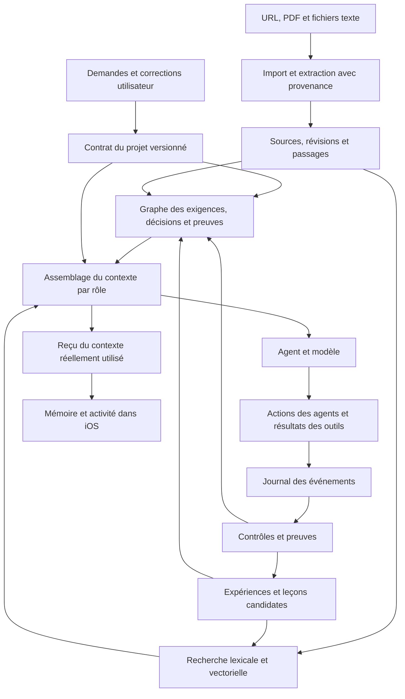

# Mémoire et contexte avancés pour monGARS

Recherche et proposition du 28 septembre 2026. **Architecture proposée, pas encore implémentée ni déployée.** Aucun modèle, index ou projet utilisateur n’a été modifié pendant cette recherche.

## Décision recommandée

Faire évoluer la mémoire existante en un système qui conserve les intentions, relie les actions à leurs preuves et prépare un contexte adapté à chaque travail. Conserver SQLite comme source métier, ajouter une recherche lexicale et vectorielle dédupliquée, puis un graphe temporel de provenance. Le vecteur est un moyen de retrouver une information ; il ne détermine ni sa vérité ni son autorité.

Il n’est pas nécessaire de remplacer GoalManager, d’installer plusieurs frameworks mémoire ou de changer immédiatement de modèle d’embeddings. Pour le volume observé, le premier gain attendu vient de la qualité des données et de leur utilisation. Cette attente doit être mesurée : aucune supériorité de performance sur nos modèles locaux n’est encore démontrée.

Deux candidats méritent ensuite un essai isolé : **Hindsight** pour une mémoire d’expériences intégrée, **Graphiti** pour des connaissances temporelles avec résolution d’entités. Les mécanismes de MemGPT, ACE, LangGraph et LlamaIndex peuvent guider notre conception sans imposer l’adoption de tous ces frameworks.

## Ce que l’audit a réellement trouvé

Instantané en lecture seule du backend le 28 septembre, vers 22:59–23:04 UTC ; ces nombres ne sont pas des compteurs permanents.

| Domaine | Observation | Conséquence |
|---|---|---|
| Mémoire générale | 1 entrée, aucun vecteur | La liste mobile ne représente pas toute la mémoire du système. |
| Épisodes | 66 épisodes, 548 étapes, aucun vecteur | L’historique terminal existe ; son interrogation reste distincte des souvenirs de projet. |
| Projets | 714 extraits, 710 vecteurs de 768 dimensions, 16 projets | L’indexation existe déjà ; elle porte surtout sur des messages et plans. |
| Projet le plus fourni | 249 vecteurs pour 70 textes distincts | 179 occurrences répétées, soit environ 72 % du total. |
| Utilisation observée | Les deux derniers jobs examinés reçoivent chacun quatre copies d’une même annonce de poursuite | Les doublons occupent réellement le contexte, pas seulement le stockage. |
| Moteur | Similarité cosinus sur des vecteurs conservés dans SQLite | FAISS n’est pas utilisé dans ce parcours. |
| Contexte de projet optionnel | Snapshots et compactions vides ; options correspondantes désactivées | Le ContextBuilder général existe, mais cela ne prouve pas une consolidation active des projets. |
| Recherche/rédaction du test CRM | Aucun lien vers la mémoire vectorielle du projet | Le passage des résultats entre agents fonctionne, mais pas ce raccordement mémoire. |
| Résultat CRM | 55 mots, une citation officielle, malgré 150–200 mots et deux citations demandés | Le statut `completed` ne prouve pas la satisfaction de la demande. |

La consigne système du rédacteur impose actuellement 100–140 mots, en contradiction avec le test. Le validateur n’impose pas les exigences de longueur et de sources ; l’évaluateur a également accepté le résultat insuffisant. Une limitation de sortie à 512 tokens existe, mais une troncature acceptée n’a pas été démontrée.

Les sources originales restent disponibles. Il faut reconstruire une projection utile, sans supprimer les conversations ni convertir les anciennes annonces de réussite en faits vérifiés. L’audit détaillé et ses identifiants sont conservés localement dans `~/Library/Logs/SwarmerMonitor/20260928-session/memory-and-quality-audit.md`.

## Ce que la recherche apporte

Les conclusions techniques ci-dessous reposent sur les documents des auteurs, dépôts des mainteneurs et documentations officielles. Les résultats de recherche examinés ne sont pas comptés comme autant d’articles intégralement lus. Les classements promotionnels ne permettent pas de choisir un gagnant pour notre matériel.

| Approche | Mécanisme utile | Choix pour monGARS |
|---|---|---|
| [MemGPT](https://arxiv.org/abs/2310.08560) | Contexte de travail borné, historique récupérable, archives et récupération paginée | Garder les originaux accessibles ; un résumé sert de point d’entrée. |
| [ACE, ICLR 2026](https://proceedings.iclr.cc/paper_files/paper/2026/file/8a94ff6f922d995d7d3f4ebf4143e442-Paper-Conference.pdf) | Entrées identifiées, propositions de deltas, fusion déterministe et raffinement | Mettre à jour les connaissances par petites modifications versionnées. Vérifier les retours qui alimentent la curation. |
| [Context engineering, Anthropic](https://www.anthropic.com/engineering/effective-context-engineering-for-ai-agents) | Chargement à la demande, notes structurées et compaction attentive aux décisions importantes | Préparer le contexte selon le rôle et la tâche ; garder des références vers ce qui est omis. |
| [Harnais pour agents de longue durée](https://www.anthropic.com/engineering/effective-harnesses-for-long-running-agents) | État durable du travail et critères de réalisation explicites | Suivre des exigences vérifiables entre les sessions ; un résumé seul ne suffit pas. |
| [Reflexion](https://proceedings.neurips.cc/paper/2023/file/1b44b878bb782e6954cd888628510e90-Paper-Conference.pdf) | Retours d’exécution conservés entre tentatives | Conserver les expériences avec leurs résultats, en séparant diagnostic et observation. |
| [Honest Lying, prépublication de mai 2026](https://arxiv.org/html/2605.29463v2) | Observe la persistance de faux diagnostics dans une mémoire réflexive | Ne pas promouvoir une explication du modèle sans preuve. Étude limitée à une architecture et de petits sous-ensembles ; ce n’est pas une loi générale. |
| [Graphiti](https://github.com/getzep/graphiti) | Épisodes sources, relations temporelles, invalidation de contradictions et recherche hybride | Reprendre la provenance et la temporalité ; comparer le moteur séparément avant d’ajouter une base graphe. |
| [Hindsight](https://github.com/vectorize-io/hindsight), [article](https://arxiv.org/abs/2512.12818) | Rétention, rappel, réflexion ; distinction entre faits, expériences et interprétations | Candidat à un essai local isolé. PostgreSQL et ses traitements ajoutent des coûts à mesurer. Le fournisseur Ollama est pris en charge ; la qualité avec nos modèles reste inconnue. |
| [LangGraph Store](https://docs.langchain.com/oss/python/langgraph/stores), [persistance](https://docs.langchain.com/oss/python/langgraph/persistence) | Checkpoints d’exécution séparés d’un magasin de mémoire entre conversations | Reprendre cette séparation. Le Store nécessite toujours une logique d’écriture et des lecteurs ; il ne produit pas automatiquement des souvenirs pertinents. |
| [LlamaIndex IngestionPipeline](https://developers.llamaindex.ai/python/framework/module_guides/loading/ingestion_pipeline/) | Identité documentaire, empreintes, cache et réindexation incrémentale | Importer une nouvelle version sans dupliquer l’ancienne ; configurer explicitement l’embedder local. |
| [Docling](https://github.com/docling-project/docling) | Extraction locale de documents structurés, PDF et OCR | Réutiliser l’adaptateur documentaire existant, puis installer et qualifier son profil Docling. Notre profil désactive actuellement l’OCR. |
| [Letta MemFS](https://docs.letta.com/concepts/memfs/index.md) | Mémoire en fichiers, versionnement Git, chargement sélectif | Bon modèle pour des notes consultables. La recherche sémantique n’y est pas implicite. Éviter deux sources de vérité concurrentes entre Markdown et SQLite. |
| [Mem0](https://github.com/mem0ai/mem0) | Extraction et récupération de souvenirs | À comparer ultérieurement. Le dépôt précise que certaines optimisations et performances du service géré ne sont pas celles du code ouvert. |

Les garanties de licence doivent être vérifiées sur les révisions retenues. Les pages consultées indiquent Apache-2.0 pour Graphiti, MIT pour le code Docling avec des licences distinctes pour ses modèles ; [Hindsight est MIT](https://github.com/vectorize-io/hindsight/blob/main/LICENSE). Les licences des versions de LangGraph et LlamaIndex à intégrer restent à qualifier.

## Architecture cible

Ce diagramme décrit une proposition. Le graphe métier ne remplace pas le DAG qui ordonne l’exécution des agents.

### 1. Conserver les intentions sans dépendre de leur score vectoriel

Un contrat versionné contient objectif, exigences actives, préférences applicables, décisions utilisateur, exclusions, critères de réalisation et questions ouvertes. Chaque entrée renvoie au message qui l’a introduite ou corrigée. Une instruction récente peut remplacer une ancienne ; le changement reste consultable.

Les exigences actives sont obligatoires dans le contexte du rôle concerné. Si elles ne tiennent pas dans son budget, le système réduit le travail ou signale le problème : il ne les tronque pas silencieusement. Un document externe ou une suggestion d’agent ne peut pas remplacer une demande utilisateur.

### 2. Séparer les catégories qui ont des usages différents

| Catégorie | Exemples | Traitement |
|---|---|---|
| Intentions | « 150–200 mots », « citer deux sources officielles » | Actives jusqu’à correction explicite ; protégées de la compaction ordinaire. |
| Connaissances | Passage d’une documentation Python, tableau d’un PDF | Source, version et emplacement ; retrouvées à la demande. |
| Observations | Outil exécuté, fichier modifié, résultat de test | Reçus et état du serveur ; ne pas confondre avec l’annonce du modèle. |
| Hypothèses | « Le délai vient probablement du chargement » | Candidats non confirmés, avec éléments favorables et contradictoires. |
| Expériences | Une tentative, son contexte et son résultat | Succès ou échec qualifié par les critères réellement vérifiés. |
| Procédures | Une manière de résoudre un problème déjà testée | Conditions d’application, preuves, contre-exemples et version. |

Le journal conserve toutes les opérations utiles à l’audit. L’index utilisé par le modèle sélectionne ce qui peut aider : « je continue » reste un événement d’interface, rarement un souvenir sémantique utile. Des essais sans progrès sont regroupés pour produire un signal de blocage, avec accès aux occurrences originales.

« Vérifié » doit toujours désigner une affirmation précise : un reçu peut prouver qu’un test a été lancé, pas que toute l’application fonctionne. Une cause supposée ne devient pas vérifiée parce que le même diagnostic a été répété.

### 3. Structurer les liens et le temps

Modèle initial dans SQLite : sources, révisions, passages, éléments mémoire, relations, preuves, versions du contrat, reçus de récupération et versions de compaction. Les vecteurs restent une projection reconstruisible.

Relations utiles : `derived_from`, `supports`, `contradicts`, `supersedes`, `requires`, `produced`, `verified_by`. Chaque relation porte sa provenance et son statut. Les exigences se relient aux livrables et aux contrôles ; les connaissances se relient à leurs sources. Une dépendance d’exécution n’est pas une preuve de réalisation.

Chaque élément comprend au minimum : identité, portée, catégorie, contenu, source et révision, auteur/origine, date d’enregistrement, validité éventuelle, statut, empreinte et version. Distinguer la date d’un fait de celle de son import. Ne pas dédupliquer deux affirmations contradictoires uniquement parce que leurs embeddings sont proches.

La mémoire générale accueille les préférences déclarées et les connaissances destinées à plusieurs projets. Les données de clients, fichiers et contraintes d’un projet restent dans leur périmètre. Une leçon peut être généralisée, mais sa promotion doit éliminer les détails privés et conserver ses conditions d’application.

### 4. Préparer le contexte à chaque étape

Pipeline proposé :

1. Charger le contrat actuel, le travail demandé, l’état et les preuves nécessaires au rôle.
2. Filtrer les candidats selon droits, projet, portée, validité et versions compatibles.
3. Chercher lexicalement et sémantiquement ; fusionner les rangs plutôt que sommer des scores de nature différente.
4. Retirer les doublons exacts et réduire les extraits très similaires ; ajouter quelques relations proches si elles apportent une preuve ou une contrainte.
5. Sélectionner les passages dans le budget du modèle, avec place réservée à la réponse et aux outils.
6. Conserver un reçu de ce qui a été effectivement injecté, ses sources, les omissions et leurs motifs.

La [recherche hybride et la fusion RRF documentées par Qdrant](https://qdrant.tech/documentation/concepts/hybrid-queries/) fournissent une référence pour la fusion ; [MMR](https://qdrant.tech/documentation/concepts/search-relevance/) aide à diversifier les résultats. Ce sont des mécanismes de sélection, pas des détecteurs de vérité. Ils peuvent être implémentés sans adopter Qdrant.

Commencer avec [SQLite FTS5](https://www.sqlite.org/fts5.html) pour la recherche lexicale et les vecteurs existants pour la sémantique. [FAISS](https://github.com/facebookresearch/faiss) est un index de similarité, pas un système complet de mémoire. Son adoption ou celle de Qdrant doit répondre à une mesure de volume, latence ou concurrence ; 710 vecteurs ne justifient pas à eux seuls une migration.

Le contrat de récupération doit servir tous les rôles autorisés, notamment recherche et rédaction. Le contexte d’un chercheur privilégie les questions et sources manquantes ; celui du rédacteur les exigences de forme et les passages citables ; celui du codeur les fichiers et preuves pertinents. Une lecture de fichier reste à la demande, avec ses instructions `AGENTS.md` applicables.

### 5. Compacter sans perdre la direction

Conserver un état compact versionné : objectif, contraintes, décisions, travail réalisé avec preuves, échecs pertinents, questions ouvertes et prochaine action. Le modèle propose des changements ciblés ; le serveur les valide et les fusionne avec une précondition de version.

Les anciennes sources restent accessibles. La compaction indique les événements couverts et ce qu’elle n’inclut pas. Une modification concurrente du projet invalide une proposition devenue périmée. Les exigences protégées font l’objet d’un contrôle de conservation ; le résumé ne doit jamais promouvoir « proposé » en « exécuté » ou « annoncé » en « vérifié ».

Des fichiers Markdown peuvent présenter cet état et les procédures, avec identifiants et version. Éviter des modifications concurrentes non réconciliées du fichier et de la base. Les [blocs mémoire Letta](https://docs.letta.com/guides/core-concepts/memory/memory-blocks/index.md) illustrent des blocs nommés, mais leur remplacement impose de traiter explicitement la concurrence dans notre conception.

### 6. Apprendre des tentatives et importer des connaissances

Une expérience associe demande, contexte pertinent, action, résultat mesuré et limites. Une procédure candidate peut résumer ce qui a aidé, mais les faits viennent des reçus et contrôles. Les contre-exemples restent disponibles. Ni une auto-évaluation positive ni un changement de compteur ne suffisent à établir une amélioration.

Importer URL/PDF/texte suit une autre chaîne : choisir projet ou général → conserver l’original → extraire → découper par structure → indexer → montrer ce qui est consultable. Garder la page, section ou plage de texte pour les citations. Signaler une extraction vide, un OCR incertain ou une source inaccessible.

Utiliser identité stable et empreinte de contenu pour les imports répétés. Un changement de version invalide les passages et faits dérivés concernés. Un lot partiel ne signifie pas que toutes les sources absentes doivent être supprimées. Une suppression demandée retire aussi l’accès aux dérivés et index ; conserver une trace d’invalidation n’autorise pas à garder indéfiniment le contenu effacé.

La récupération améliore ce que le modèle peut consulter ; elle ne réentraîne pas ses poids. Les pages et fichiers importés sont des données de référence, pas des instructions autorisant de nouvelles actions.

État vérifié : `workers/personal-worker/requirements-docling.txt` déclare un profil optionnel séparé. Docling n’est présent ni dans le venv API local ni dans le venv API actif d’Ubuntu ; aucun agent enregistré n’expose `documents.extract`. Le code TXT/Markdown et l’adaptateur PDF/DOCX avec provenance sont réutilisables, mais le moteur, ses modèles et un corpus de qualification restent à provisionner. L’OCR désactivé dans cet adaptateur doit être traité explicitement pour les PDF scannés.

## Ce que l’utilisateur verrait

Une vue **Mémoire** unifiée, filtrable par Général/Projet :

- **À retenir** : objectif, exigences, préférences et décisions actuelles ; correction possible avec historique.
- **Documents** : imports, versions, état d’extraction et passages citables.
- **Expériences** : ce qui a été tenté, ce qui a marché, ce qui reste incertain et les preuves associées.
- **Utilisé maintenant** : souvenirs réellement transmis à chaque agent, source et rôle dans la réponse.

Dans l’activité d’un projet, afficher par exemple « Recherche de deux sources officielles », puis « Une source officielle manque », avec les opérations et les résultats. Ajouter une courte justification explicite de la prochaine action, reliée aux exigences et preuves ; ce texte d’explication n’est pas une preuve de succès ni une transcription supposée du raisonnement interne.

Le résultat principal doit afficher le document demandé et ses contrôles. Les reçus techniques restent accessibles en détail. Une opération backend terminée et un livrable conforme sont deux états distincts.

Une API commune fournit inspection, récupération, import, correction, historique et suppression. Les inspections doivent rester en lecture seule ; l’app et les agents appellent les mêmes contrats. L’écriture automatique de souvenirs utiles doit être observable et idempotente.

## Déroulement conseillé et critères de passage

| Lot | Travail | Preuve attendue avant activation |
|---|---|---|
| 1 — Fiabilité immédiate | Corriger la consigne du rédacteur, contrôler les exigences mesurables, afficher le livrable | Le test CRM échoue correctement avec 55 mots et réussit seulement avec 150–200 mots et les deux liens officiels vérifiés. |
| 2 — Identité et mémoire utile | Lier tous les rôles au projet, classer les entrées, dédupliquer la récupération, exposer les reçus | Les quatre résultats ne sont plus quatre copies ; recherche/rédaction reçoivent les souvenirs attendus. |
| 3 — Direction durable | Contrat versionné, graphe de preuves et compaction par deltas | Les corrections utilisateur survivent à la compaction et à deux agents concurrents ; aucune fausse promotion de statut. |
| 4 — Bibliothèque | Import URL/PDF/texte, extraction, indexation incrémentale et interface | Import répété sans duplication, réponse citant le passage exact, correction et suppression propagées. |
| 5 — Expériences | Leçons candidates et procédures assorties de preuves | Une ancienne fausse réussite ne devient pas une recommandation ; les contre-exemples restent récupérables. |
| 6 — Comparaison | Version interne contre Hindsight, puis Graphiti si utile | Mêmes données, modèles et budgets ; gains mesurés justifiant les nouveaux services. |

Les lots 2 et 3 peuvent être développés en parallèle sur des interfaces convenues. Le lot 1 est une condition pour transformer des résultats en leçons fiables. Chaque lot doit avoir un test complet avant de passer au suivant ; aucune estimation de performance ou date de livraison n’est déduite des articles.

Déployer d’abord une nouvelle projection en mode observation, issue d’une copie cohérente des sources. Comparer les sélections sans influencer les agents. Activer ensuite la lecture sur un projet de test, puis l’écriture et l’import. Conserver les sources et la compatibilité de schéma ; un retour arrière doit changer les lecteurs, pas restaurer une ancienne base sur des écritures récentes.

## Comment vérifier que c’est réellement mieux

S’inspirer des tâches de [LongMemEval](https://github.com/xiaowu0162/LongMemEval) et de la temporalité de [LoCoMo](https://snap-research.github.io/locomo/), puis utiliser des cas propres à monGARS. Ces benchmarks n’attestent pas que notre système termine un projet.

| Essai | Attendu |
|---|---|
| Exigence modifiée entre deux sessions | La nouvelle est active, l’ancienne reste historique. |
| Même document importé trois fois | Une identité logique ; aucun triplement des souvenirs. |
| Quatre copies d’une annonce de poursuite | Résultats distincts ; annonce écartée si elle n’aide pas. |
| Source disant « proposé », message disant « terminé » | La mémoire ne présente pas une réalisation vérifiée. |
| Fait absent ou contradictoire | Absence ou conflit signalé avec provenance, sans invention. |
| PDF corrigé puis supprimé | Version courante utilisée, puis aucun contenu supprimé récupéré. |
| Projets A et B avec clients différents | Aucune fuite de contexte ou confusion d’identité. |
| Compaction après longue conversation | Objectif, exigences, décisions et blocages conservés. |
| Écriture simultanée de deux agents | Conflit détecté ou fusion validée ; pas d’écrasement silencieux. |
| Note CRM insuffisante mais juge `done` | Verdict de non-conformité conservé. |

Comparer successivement : système actuel, déduplication seule, récupération hybride, graphe limité, puis compaction. Garder modèles et budgets identiques. Mesurer rappel des preuves utiles, proportion de doublons, respect des exigences, citations exactes, erreurs temporelles, latence médiane/p95, tokens et appels supplémentaires.

Utiliser aussi un contexte « oracle » contenant uniquement les preuves nécessaires : s’il échoue, le problème n’est pas seulement la récupération. Pour les exigences mesurables, les assertions déterministes priment sur le verdict d’un juge modèle. Conserver les tests de qualité humaine pour les critères qui ne se réduisent pas à un compteur.

## Raccordement au code existant

Les points de départ identifiés pendant l’audit sont `ContextBuilder`, `ProjectMemoryService`, `StrategyRetrieval`, `EpisodeMemoryService`, `goal_project.py`, les payloads de `GoalManager` et le validateur du worker rédaction. Voir aussi [Context Engineering v0.12](../29-context-engineering.md) et [Episodic Memory v0.12](../30-episodic-memory.md).

Les éléments de ces documents marqués implémentés ne doivent pas être assimilés à des fonctionnalités activées ou qualifiées en production. La priorité est de relier les parcours existants, de rendre leur utilisation visible et d’ajouter les contrôles manquants. Ce rapport n’active aucune option et ne remplace pas la validation sur Ubuntu et l’iPhone.
