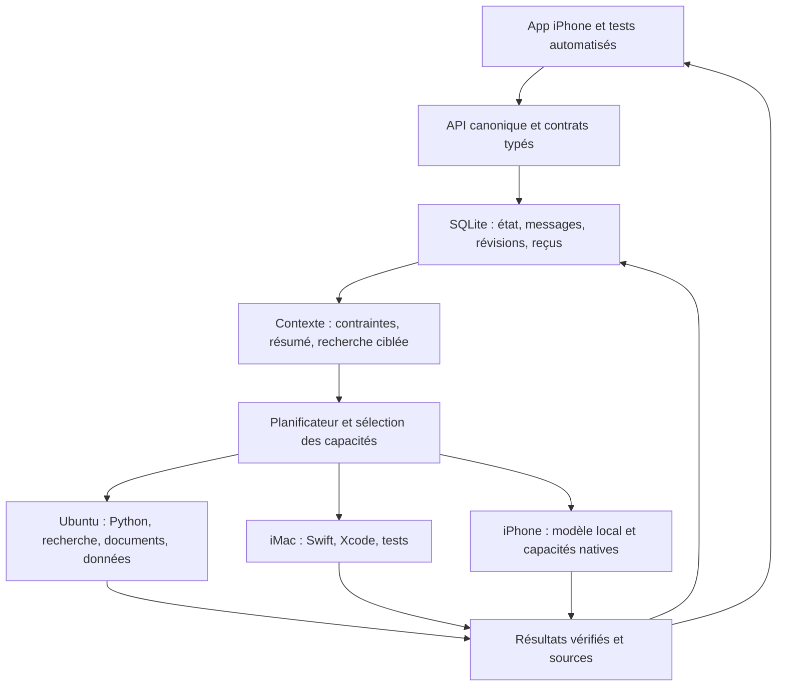

# monGARS : agents spécialisés, mémoire et contexte

Recherche et proposition d'architecture — 22 septembre 2026.

**La meilleure prochaine étape pour notre installation est de renforcer le
contexte, les outils et la vérification des résultats avant d'augmenter le nombre
d'agents.** Conserver l'API et le moteur d'exécution actuels permet d'intégrer les
avancées utiles sans perdre les historiques, les budgets et les preuves déjà
présents. C'est notre recommandation d'intégration, pas un classement universel
des frameworks ou des modèles.

Cette étude consolide les demandes discutées : spécialistes SQLite, Swift et
Python ; développeur avancé ; assistant personnel pour agenda, documents, CRM
et organisation ; mémoire partagée ; meilleure utilisation du contexte avec
compaction ; outils pilotables par l'API et validation réelle sur iPhone, iMac et
Ubuntu. Elle ne déploie aucune de ces nouvelles capacités.

## Périmètre et méthode

Quatre axes ont été étudiés : contexte et mémoire ; spécialistes et outils ;
assistant personnel et orchestration ; modèles et exécution locale. Les
26 recherches ont retourné **260 résultats**, soit **248 URL distinctes après
normalisation**. Ce sont des candidats examinés, et non 248 sources toutes
retenues ou validées. Les récupérations documentaires couvrent **58 URL
distinctes**, avec des extraits de taille bornée ; une page était un avis de
déplacement, suivi jusqu'à la nouvelle spécification. Les lectures directes de
README et de métadonnées GitHub complètent ce corpus.

La recherche privilégie les nouveautés du 22 mars au 22 septembre 2026, tout en
conservant les travaux antérieurs nécessaires à la comparaison. Les conclusions
techniques s'appuient sur les documents des auteurs, les dépôts, les articles de
recherche et les échanges publics avec les mainteneurs. Les billets secondaires
servent à découvrir des pistes. Une issue isolée n'établit pas un défaut général,
et un benchmark publié n'est pas une mesure sur notre installation.

Le [journal consolidé](research-index.json) contient les requêtes, URL et comptes.
Chaque axe conserve ses sources et ses limites dans les fichiers voisins.

## Ce qui existe et ce qui manque

Inspection du dépôt à partir de `e112baf`, complétée par les vérifications de
versions locales. Les états du serveur rappelés ici viennent du contrôle de
déploiement de ce matin ; cette recherche n'a effectué aucune nouvelle opération
sur les projets de production.

| Sujet | État constaté | Conséquence |
| --- | --- | --- |
| Catalogue | 26 rôles, 79 compétences : 10 compétences worker, six ponts iPhone et 63 descriptions prévues | Un rôle affiché ne prouve pas une capacité exécutable |
| Agents connectés | Cinq workers répondaient au dernier contrôle de déploiement | Ne pas confondre rôles, compétences et processus actifs |
| Développement | Projets Python/Node avec contrôles ; génération Python simple distincte | Renforcer le développeur existant avant de le dupliquer |
| Swift | Aucun runtime de projet Swift parmi python/node/python_node | Ajouter le routage vers un worker de compilation sur l'iMac |
| SQLite | Utilisable dans le code Python ; aucun contrat métier dédié d'inspection/migration | Ajouter des outils explicites et leurs reçus |
| Mémoire | Services de récupération et embeddings présents dans le code, avec repli lexical | Mesurer le mode réellement utilisé, les sources retrouvées et les absences |
| Contexte | Contexte borné, fichiers ciblés, historique raccourci ; pas de synthèse durable complète | Une ancienne contrainte peut être écartée sans être conservée explicitement |
| iPhone | MLX Swift LM 3.31.4, MLX 0.31.4 ; Xcode 26.3 sur l'iMac | Évaluer les nouvelles bibliothèques contre ces versions précises |

Repères locaux : [catalogue](../../server/app/data/activity_catalog.json),
[contexte](../../server/app/services/context_builder.py),
[mémoire projet](../../server/app/services/project_memory.py),
[payload projet](../../server/app/services/goal_project.py),
[worker projet](../../workers/project-worker/project_worker.py),
[dépendances iOS](../../mobile/modules/swarmer-local-inference/ios/SwarmerLocalInference.podspec).

## Ce que les sources changent dans notre approche

**La compaction doit préserver une mémoire vérifiable.** Les approches documentées
par [Anthropic](https://www.anthropic.com/engineering/effective-context-engineering-for-ai-agents)
et [Letta](https://docs.letta.com/guides/core-concepts/memory/memory-blocks/index.md)
distinguent le contenu disponible au modèle et la mémoire conservée hors de sa
fenêtre. Nous retenons des décisions structurées, des liens vers les sources et
des lectures ciblées. Une synthèse ne doit jamais transformer une proposition
ou une affirmation du modèle en résultat exécuté.

**Plus de mémoire injectée n'améliore pas toujours une décision.** Les travaux
comparant masquage d'observations et résumés, ainsi que
[Harness the Memory](https://arxiv.org/abs/2608.15008), justifient une comparaison
expérimentale plutôt qu'une adoption systématique de résumés générés ou de graphes.
La prépublication d'août 2026 reste une indication de recherche, pas une garantie
sur notre modèle. Les détails, protocoles et limites figurent dans l'axe mémoire.

**Le code public ne signifie pas toujours une intégration simple ou une licence
permissive.** Les projets de mémoire ajoutent leurs propres magasins, migrations
et exécutions ; certains automatiseurs ont des restrictions commerciales.
Notre choix doit compter le coût d'exploitation et de migration, en plus des
fonctions annoncées. Les licences du code, des modèles et des services sont
traitées séparément dans les notes spécialisées.

**La nouveauté la plus utile peut déjà être dans notre version.**
[MLX Swift LM 3.31.4](https://github.com/ml-explore/mlx-swift-lm/blob/3.31.4/Package.swift)
contient MLXEmbedders. En revanche, le module de génération guidée vu sur main
n'est pas dans ce tag. La présence du nouveau pont Foundation Models et de son
exigence SDK 27 ne doit pas être confondue avec celle des autres modules.

## Architecture cible

L'API conserve le contrat canonique des capacités, opérations, permissions et
résultats. La base conserve l'état faisant autorité. L'interface iOS, les tests
automatisés et les agents consomment ces mêmes contrats. Les résumés et index
vectoriels sont des vues dérivées, reconstruisibles depuis les sources.

Un rôle spécialisé définit ses compétences, son environnement, son budget et ses
critères de réussite. Plusieurs rôles peuvent partager un modèle. Le choix du
modèle et la concurrence d'exécution restent limités par la mémoire disponible,
le temps de réponse et les ressources de chaque machine.

## Équipe proposée

Il s'agit de rôles logiques ; les nouvelles lignes de cette table ne sont pas
encore des agents déployés.

| Rôle | Outils ou travail concret | Environnement prévu | Preuve attendue |
| --- | --- | --- | --- |
| Coordinateur | Décomposer, router, suivre les dépendances et budgets | Contrôle central existant | Plan valide et états cohérents |
| Architecte / développeur avancé | Architecture, changements transversaux, débogage | Worker projet renforcé | Révision acceptée, tests et limites explicites |
| Python | API, automatisations, applications | Ubuntu isolé | Vérification syntaxique, tests exécutés, artefacts |
| Swift/iOS | Modifier, compiler, tester | iMac avec Xcode ; iPhone comme cible | Résultat Xcode, tests, installation et exécution distingués |
| SQLite | Créer, inspecter, migrer, sauvegarder | Workspace autorisé sur Ubuntu/iMac | Schéma avant/après, sauvegarde, intégrité, effet de la migration |
| Recherche | Requêtes/extraits existants ; lecture des pages et datation à ajouter ou qualifier | SearXNG et worker existants, adaptateur de lecture proposé | Aujourd'hui title/url/snippet ; cible : pages lues, dates et réponse sourcée |
| Documents / administration | Extraire PDF, tableaux et notes ; préparer documents | Ubuntu, adaptateur Docling ou MarkItDown | Document source, pages et extraction contrôlée |
| Agenda / organisation | Lire disponibilités, préparer horaires et rappels | Ponts iPhone et connecteurs à définir | Objet calendrier ou rappel retrouvé après l'opération |
| CRM / projets | Clients, soumissions, échéances et suivis préparés | Adaptateur CRM ou base métier dédiée | Identifiants et état persistant vérifiés |
| Mémoire / connaissances | Indexer, retrouver, invalider et expliquer les sources | Service partagé, index locaux possibles | Sources retrouvées et fraîcheur connues |
| Intégrations / automatisations | Appeler des outils externes et suivre les opérations | Adaptateurs API/MCP contrôlés | Reçu de l'outil et identifiant d'opération |
| Qualité / tests | Reproduire, tester, comparer et signaler les régressions | Ubuntu/iMac/iPhone selon le cas | Comptes de tests réels et échecs reproductibles |

Le développeur reste responsable des changements d'un même projet : SQLite et
Swift peuvent fournir leurs opérations spécialisées sans provoquer des écritures
concurrentes incohérentes. Le planificateur doit sélectionner une plateforme
compatible, et pas seulement un nom d'agent.

## Protocole de contexte proposé

1. **Journal original conservé.** Messages, sorties d'outils, révisions et tests
   sont enregistrés avec leurs identifiants. Une réduction de contexte n'efface
   pas les sources.
2. **État structuré du projet.** Séparer objectif, contraintes, décisions,
   faits vérifiés, travail proposé, changements acceptés, tests, problèmes et
   prochaine action. Chaque entrée référence les sources et la révision utile.
3. **Budget calculé avant chaque appel.** Partir du contexte effectif configuré,
   soustraire instructions, schémas d'outils, sortie réservée et marge. Utiliser
   le tokenizer du modèle lorsque possible ; signaler une estimation autrement.
4. **Sélection adaptée à la tâche.** Dernière instruction et contraintes critiques,
   état de travail récent, puis sources pertinentes. Charger les outils utiles
   progressivement. Un agent SQLite n'a pas besoin de tous les logs Xcode.
5. **Réduction graduelle.** Éliminer les doublons et remplacer les anciennes sorties
   volumineuses par leurs références avant de résumer les échanges anciens.
   Conserver les appels d'outils et leurs résultats associés de façon cohérente.
6. **Compaction contrôlée.** Produire un résumé candidat lié à la plage de messages,
   à la version et aux sources. Vérifier contraintes et statut des preuves avant
   adoption ; reconstruire depuis les originaux lorsqu'un résumé dérive.
7. **Recherche hybride bornée.** Requête lexicale et sémantique, filtres projet,
   personne, date et portée ; fusion et éventuel reclassement. Récupérer un passage
   original lorsqu'un résumé ne suffit pas à répondre.
8. **Mise à jour explicite.** Une nouvelle décision peut remplacer une ancienne,
   sans effacer la chronologie. Les permissions et validations exécutables restent
   vérifiées dans l'état central ; un résumé ne les accorde jamais.

Contrat proposé pour une compaction : `project_id`, `summary_version`,
`conversation_revision`, `covered_message_ids`, `base_revision_id`, `source_ids`,
`constraints`, `decisions`, `verified_results`, `pending_work`, `uncertainties`.
Ces champs sont une spécification à implémenter, pas un schéma déjà déployé.

La mémoire à long terme, le contexte envoyé au modèle et son cache KV doivent
être observables séparément. La compaction du texte ne compresse pas à elle seule
les poids du modèle et n'assure pas la continuité d'un cache après interruption.

## Projets à privilégier

| Option | Décision proposée | Motif principal |
| --- | --- | --- |
| API, SQLite, DAG et contrôles Swarmer | Conserver | Historique et mécanismes d'exécution déjà présents |
| Principes Letta, LangMem, Anthropic | Adapter | Résumés structurés, sources externes à la fenêtre, récupération progressive |
| Mem0 / Graphiti | Essais comparatifs ciblés | Utiles à évaluer ; adoption entière non justifiée sans gain local |
| sqlite-vec + recherche SQLite | Prototype limité | Index vectoriel proche du stockage existant ; vérifier performances et distribution iOS |
| sqlite-utils / GRDB.swift | Utiliser selon la couche | Outillage Python et accès Swift aux bases ; éviter deux systèmes de migration concurrents |
| XcodeBuildMCP | Adaptateur sur iMac | Exposer compilation et tests via des opérations explicites |
| uv, Ruff, pytest | Renforcer le parcours Python | Livrables contrôlés par des outils déterministes |
| MCP | Ajouter à la frontière des outils | Contrats et découverte ; garder l'autorité dans notre API |
| A2A | Différer jusqu'à un besoin d'interopérabilité | Ne crée pas à lui seul les capacités d'un agent |
| Docling / MarkItDown | Comparer sur nos documents | Extraction et provenance avant indexation |
| OpenTelemetry + Langfuse ou Phoenix | Choisir une seule chaîne de traces initiale | Comparer latence, appels, erreurs et contexte sélectionné |
| MTEB + tests mémoire + scénarios monGARS | Prioritaire | Mesurer les progrès réellement utiles en français et en anglais |
| MLXEmbedders / modèles compacts | Comparer sans changer les defaults | Tester E5, EmbeddingGemma et Qwen selon les appareils |

Les [notes spécialistes](specialists-tools.md),
[notes orchestration](assistant-orchestration.md),
[notes mémoire](context-memory.md) et [notes modèles](local-models.md)
détaillent les sources, licences, limites et alternatives de chaque décision.

## Ordre d'implémentation et critères de passage

| Lot | Livrable | Condition pour poursuivre |
| --- | --- | --- |
| 0 — Référence mesurée | Traces contexte/outil/modèle, jeux d'essai et état mémoire réel | Reproduire les limites actuelles ; identifier tokenizer, fenêtre et modèle effectifs |
| 1 — Contexte durable | État structuré, compaction versionnée, récupération des originaux | Les contraintes critiques survivent ; aucun résultat proposé présenté comme testé |
| 2 — Mémoire hybride | Recherche lexicale + embeddings, provenance et fraîcheur | Gain sur corpus FR/EN par rapport au repli lexical, sans fuite entre projets |
| 3 — Spécialistes | SQLite et Swift réellement outillés ; Python renforcé | Migration contrôlée et tests Xcode/pytest avec reçus de la bonne révision |
| 4 — Assistant personnel | Documents, agenda et CRM via adaptateurs explicites | Aller-retour API : opération, persistance et vérification de l'objet créé |
| 5 — Modèles / performance | Comparaison des presets et du cache, embeddings iPhone | Gain de qualité ou de latence sans régression mémoire, thermique ou stabilité |

Ne pas fixer une date de déploiement avant les essais des lots 0 et 1 : les
connecteurs disponibles, la toolchain et le débit des modèles conditionnent la
charge réelle. Chaque lot peut être livré séparément derrière un réglage.

## Campagne d'évaluation proposée

Commencer par 50 scénarios synthétiques sans données privées, couvrant :
contraintes anciennes, corrections d'exigences, homonymes, chronologie,
compaction répétée, résultat d'outil contredisant le modèle, réponses incomplètes,
reprise après arrêt, double exécution, bases et projets distincts. Ajouter des
cas Python/SQLite et Swift compilables, puis documents/agenda/CRM.

Comparer au moins quatre variantes : réduction actuelle ; masquage des sorties
refetchables ; résumé structuré ; résumé plus récupération hybride. Employer les
mêmes modèles, révisions, données et budgets pour rendre la comparaison utile.

Mesures : réussite fonctionnelle, contraintes conservées, faux succès, erreurs
d'arguments, rappel des sources, appels nécessaires, tokens réels, latence p50/p95
et coût mémoire. Pour l'iPhone : consommation, température, stabilité et reprise.
Un test qui n'a rien exécuté ne valide pas le livrable.

Critères proposés, **pas des résultats déjà obtenus** : zéro faux succès et zéro
double effet dans les scénarios de contrôle ; toutes les contraintes critiques
conservées ; aucune contamination entre projets ; moins de contexte envoyé à
qualité au moins équivalente. Les seuils de latence et de rappel seront fixés
après la mesure de référence, plutôt qu'inventés depuis des benchmarks tiers.

## Limites de cette étude

La recherche croise documentation, dépôts, publications et discussions publiques
de mainteneurs ; elle ne prétend pas avoir parcouru tous les groupes ni les
espaces privés. Les benchmarks d'auteurs restent attribués, les prépublications
restent expérimentales, et les incidents GitHub sont bornés aux versions décrites.
Les notes distinguent recherche documentaire, code présent, installation et
qualification sur appareil. Aucun nouveau benchmark local, connecteur, index,
agent ou modèle n'a été activé pendant ce travail.
